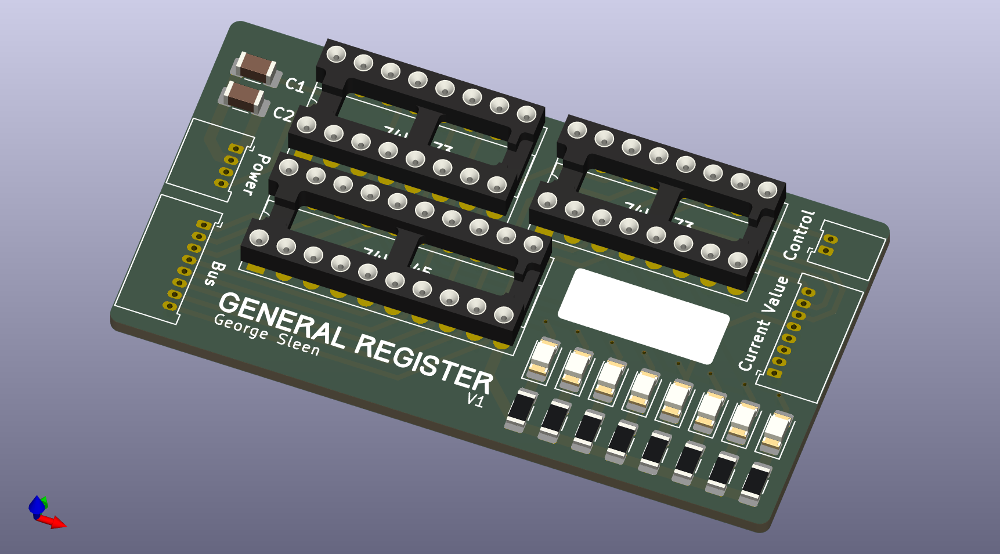
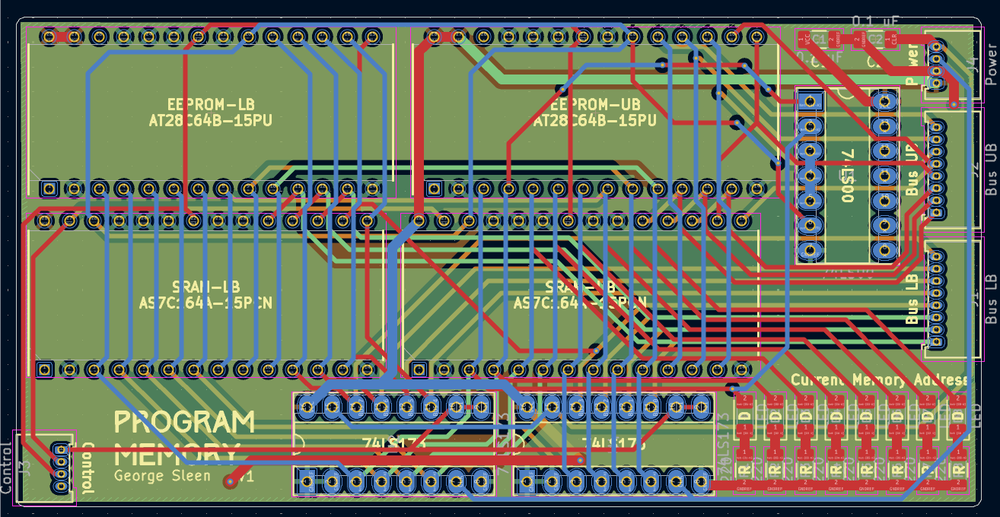
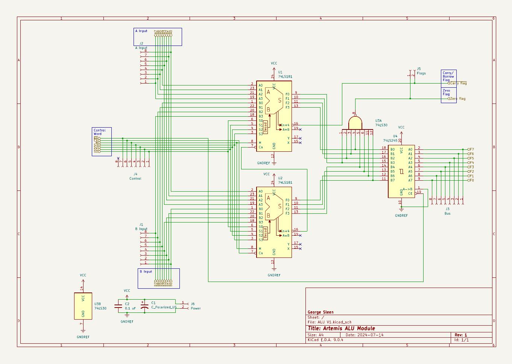
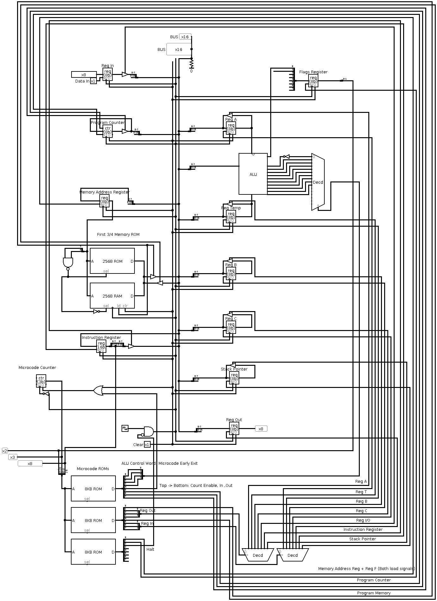

# 8-Bit Computer

## Overview
This project was a ground-up implementation of a fully custom **8-bit computer**, built from discrete logic components and custom PCB modules.  
The system is **Turing-complete**, capable of executing a minimal instruction set, and was developed as a way to explore computer architecture at the gate and register-transfer level.

The design takes inspiration from [Ben Eater’s breadboard computer](https://eater.net/), but expands it with a modular PCB-based implementation, Logisim simulations, and a structured hardware layout.

---

## Contributions
- **Architecture Definition**: Designed a simple but complete 8-bit instruction set and system architecture (registers, ALU, program counter, memory, control logic).
- **Schematic & PCB Design**: Created KiCad schematics and PCB layouts for the computer’s core subsystems (general registers, ALU, program memory).
- **Simulation & Verification**: Validated the instruction set and control logic in Logisim before committing to hardware.
- **System Integration**: Built and tested each module in isolation, then integrated them onto a shared bus.
- **Demonstration**: Successfully ran small programs demonstrating arithmetic operations and data output.

---

## Technical Highlights
- **Registers**: Designed custom register boards with tri-state buffer outputs and synchronous load.
- **ALU**: Implemented addition, subtraction, and bitwise logic operations with discrete logic gates.
- **Memory**: Designed a program ROM PCB and accompanying RAM for instruction storage.
- **Control Logic**: Implemented fetch–decode–execute sequencing via microcoded control signals.
- **Bus Design**: Shared system bus with tri-state management across modules.

---

## Media

### Repository
[GitHub – 8-Bit Computer](https://github.com/georgesleen/8-BitComputer)

### Hardware & Schematics
- *General Register*  
  

- *Program Memory PCB*  
  

- *ALU Schematic*  
  

### Simulation
- *Full simulated computer*  
  

- *Simple program execution:*

    1. Load `4` into Register A
    2. Add `13` to Register A
    3. Output result to output register

  <video src="videos/simple-program.mp4" controls style="width:100%; height:auto; display:block;"></video>

---

## Reflection
This project provided a first-principles understanding of how digital computers operate at the logic level.  
Key takeaways included:
- How simple bit manipulation and storage gives rise to the complex programs run by computers.
- Using simulation to de-risk hardware design.
- Appreciating the tradeoffs between simplicity, expandability, and physical wiring complexity.

If extended further, this design could support conditional branching, subroutines, or pipelining.
