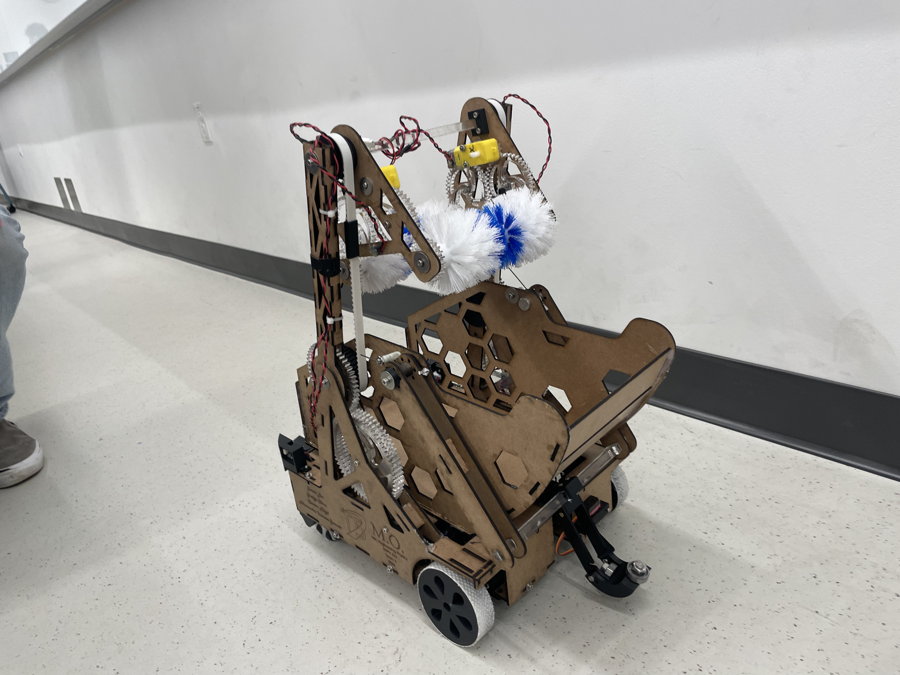
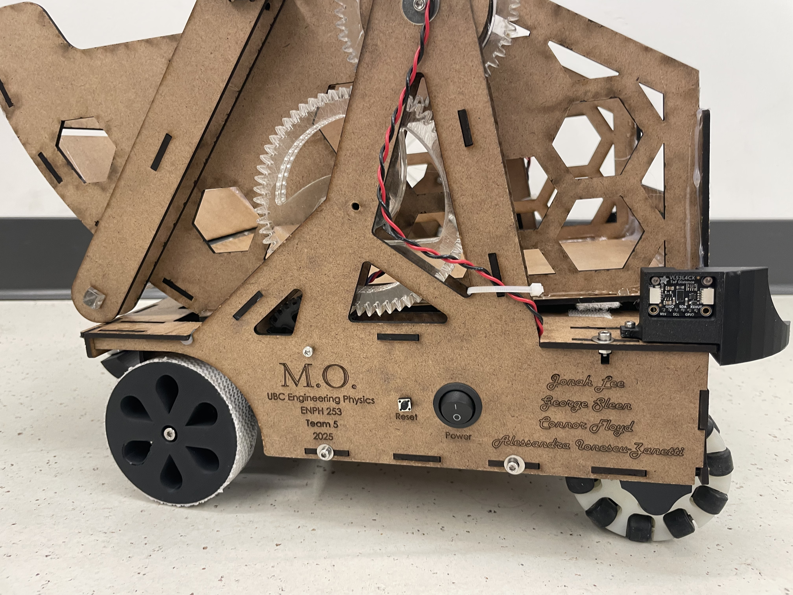
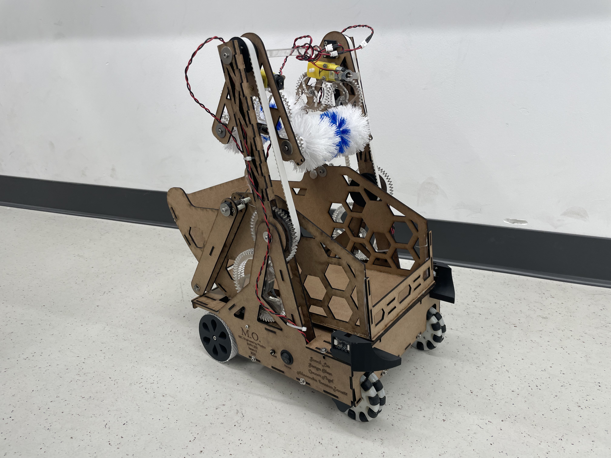
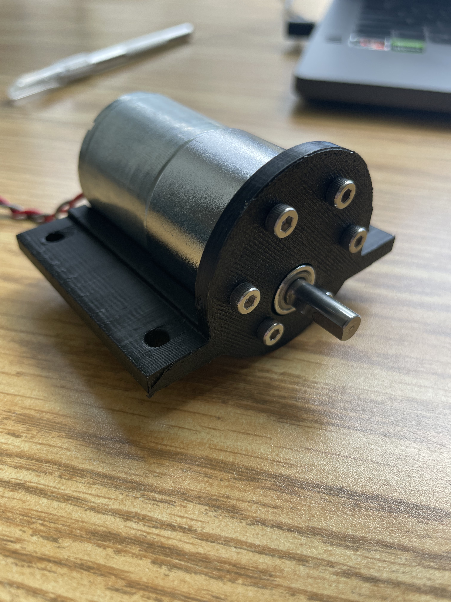
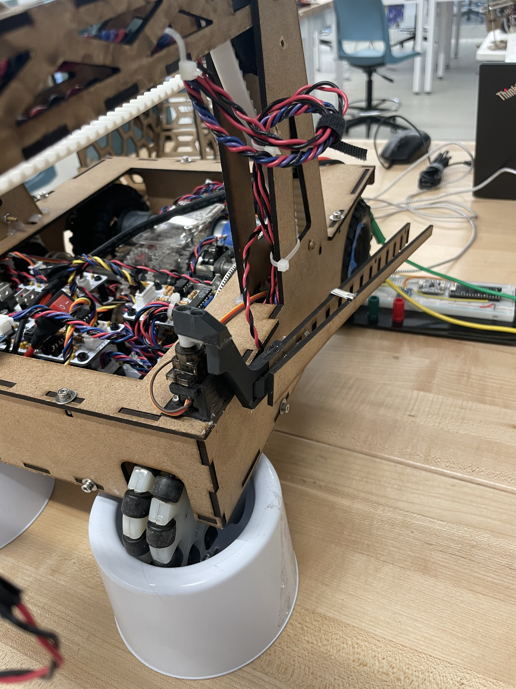
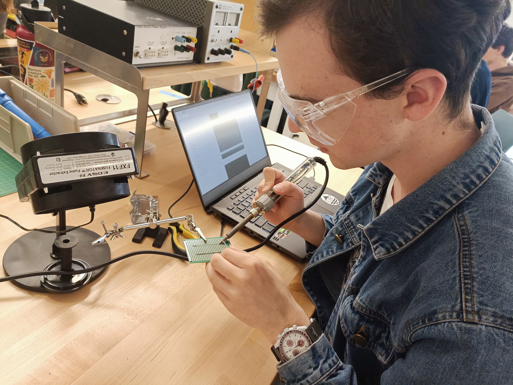
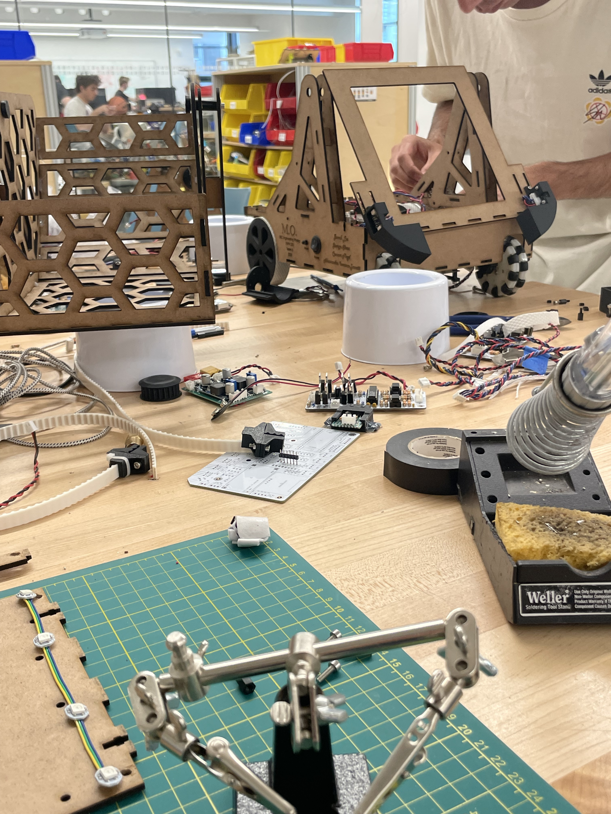
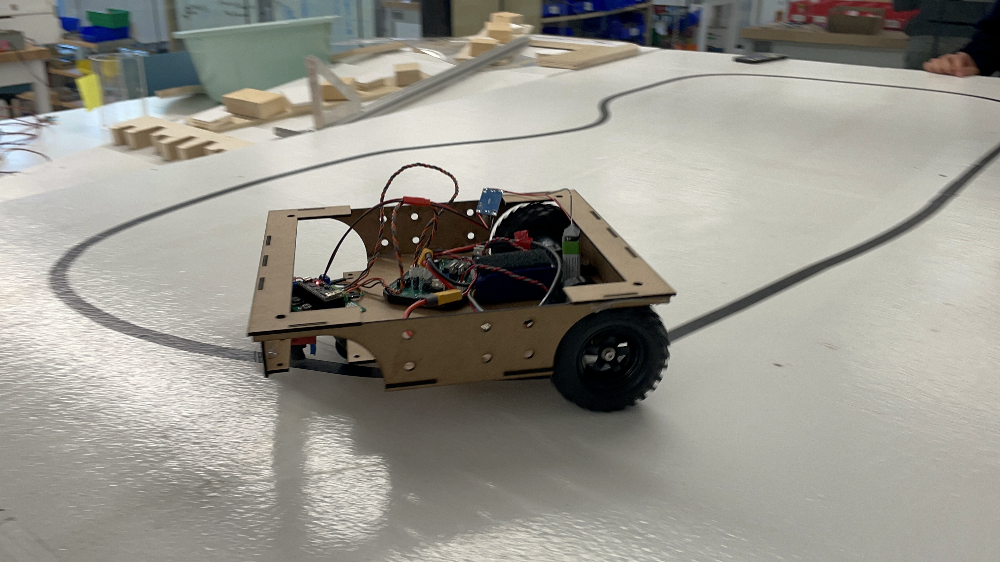
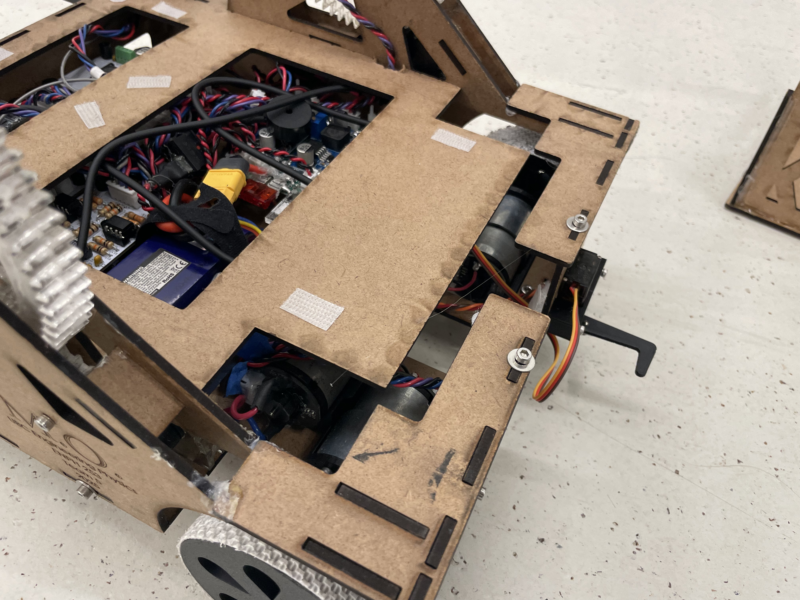
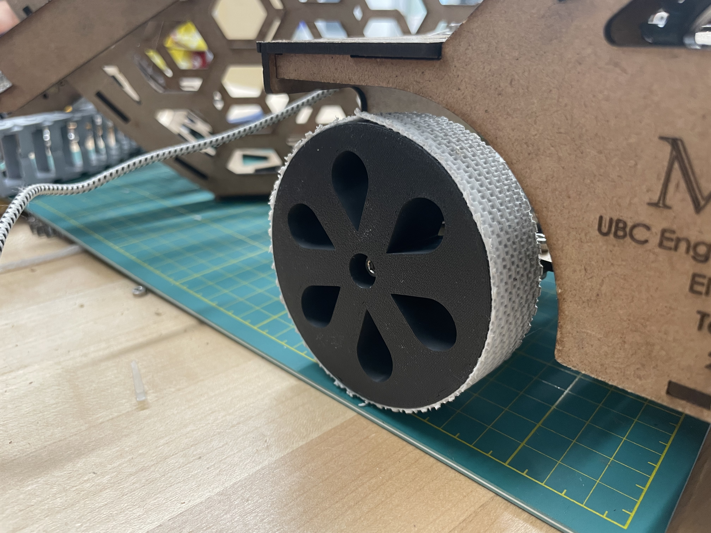

# 'M.O.' - Autonomous Pet Retrieval

# UNDER CONSTRUCTION

## Overview

ENPH 253, colloquially known as 'Robot Summer' is all about bringing a robot to life in the span of six weeks.

This year's challenge was to rescue seven pets (stuffies) from a burning building (obstacle course) and return them to
safety. Our robot needed to be able to do this completely autonomously.

Our robot 'M.O.' (named after the cleaning robot in Wall-E) used LiDAR to detect pets, toilet brushes to grab them, and
a basket that attached to the zipline to return them to safety.

I was the electrical lead on the team, designing most circuits for our robot, as well as a contributor to much of the
control firmware.

*Electrical Contributions*

- Designed the h-bridge for electrical control of our drive system
- Managed PCB design, assembly, and troubleshooting
- Designed around limited pin constraints of an ESP32 with multiplexing and multi-drop buses

*Firmware contributions*

- Solved concurrent access to I2C buses with freeRTOS
- Implemented PID control to close the control loop on all motors
- Managed codebase complexity by ensuring adequate documentation in all code

### GitHub Organization

[github.com/enph253-2025-team5](https://github.com/enph253-2025-team5)

## Media

### Final Robot

  
  
  

### Electronics & Assembly

  
  
  
  
  
  
  
  

### Trials & Demos

<video src="media/debris-traversal.mp4" controls style="width:100%; height:auto; display:block;"></video>  
<video src="media/failed-detection-wing-pickup.mp4" controls style="width:100%; height:auto; display:block;"></video>  
<video src="media/first-line-following.mp4" controls style="width:100%; height:auto; display:block;"></video>  
<video src="media/jank-pet-pickup-with-voiceover.mp4" controls style="width:100%; height:auto; display:block;"></video>  
<video src="media/magnetic-pet-tracking.mp4" controls style="width:100%; height:auto; display:block;"></video>  
<video src="media/simple-pet-pickup.mp4" controls style="width:100%; height:auto; display:block;"></video>  
<video src="media/time-trials.mp4" controls style="width:100%; height:auto; display:block;"></video>  
<video src="media/very-first-pet-pickup-with-voiceover.mp4" controls style="width:100%; height:auto; display:block;"></video>  
<video src="media/zipline-basket.mp4" controls style="width:100%; height:auto; display:block;"></video>  

