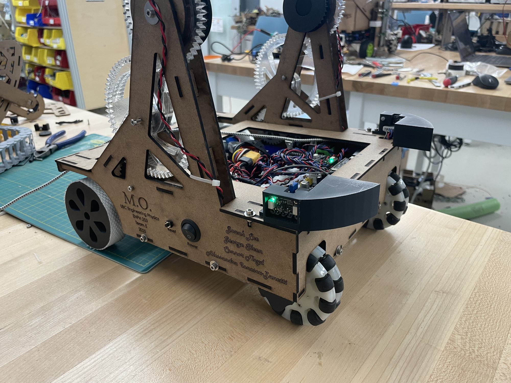
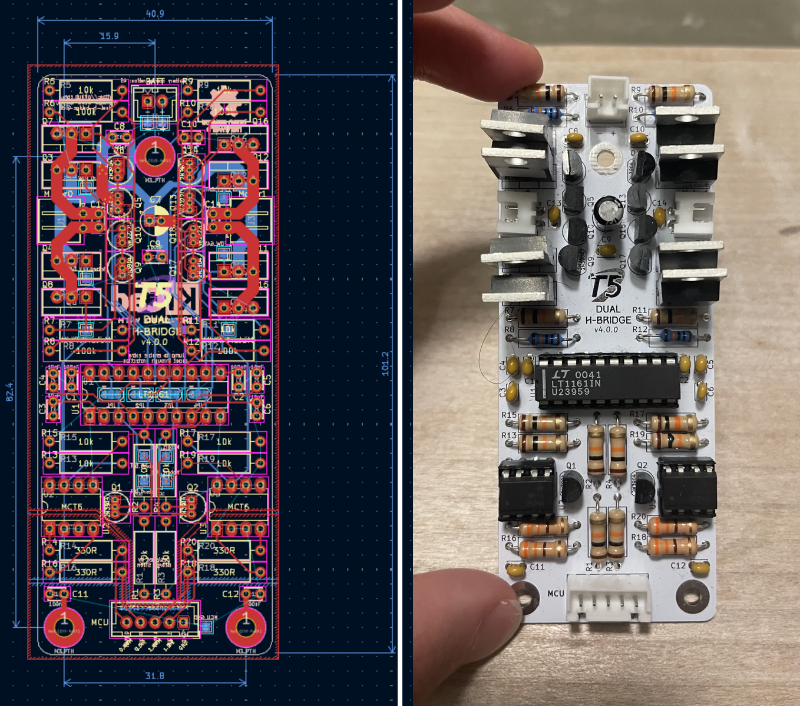
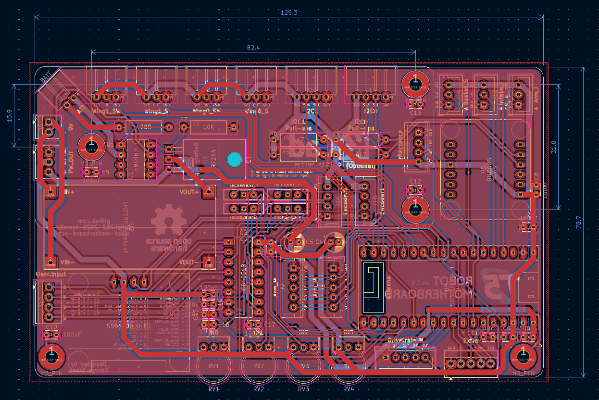
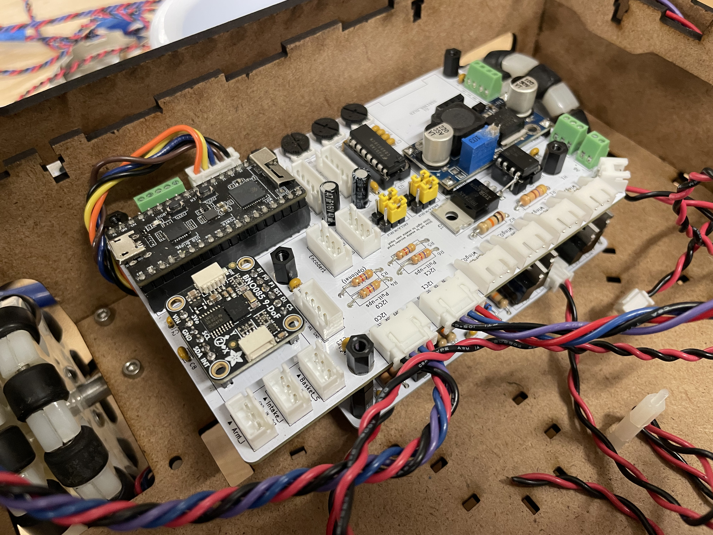
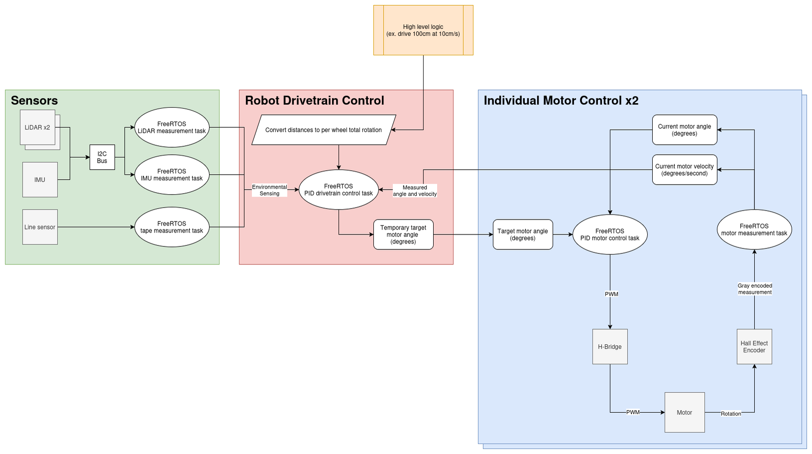
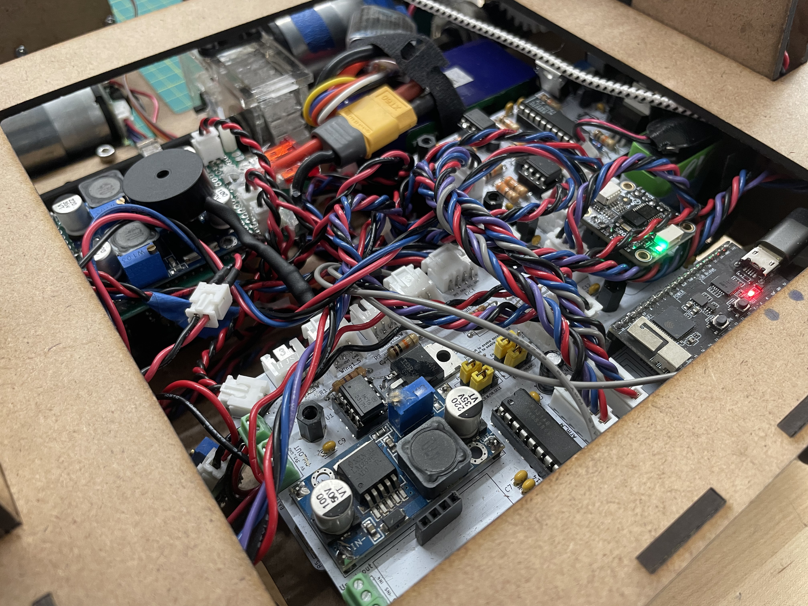
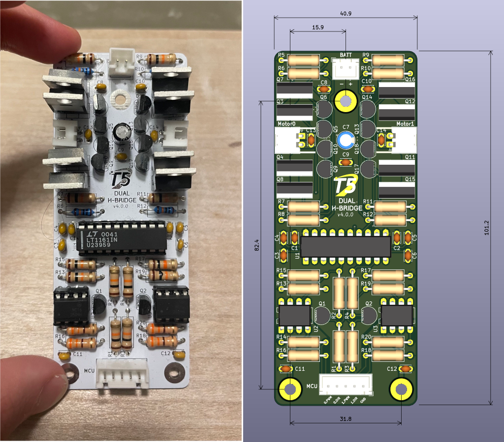
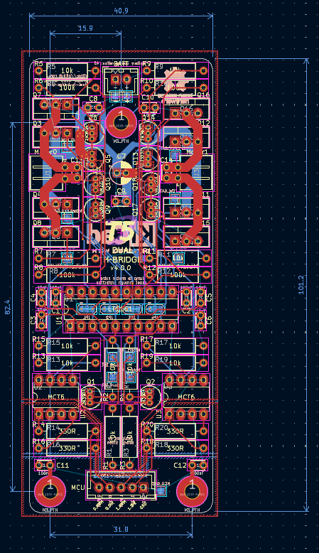
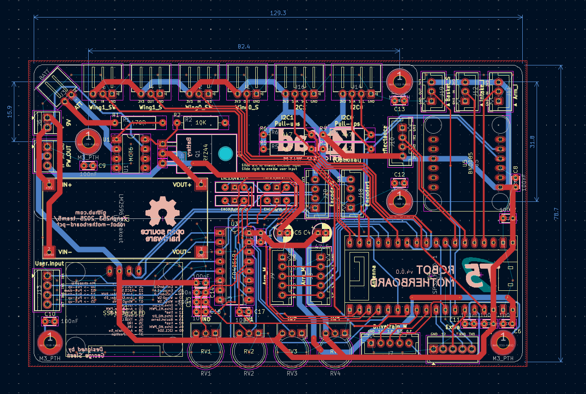

# “M.O.” – Autonomous Pet Retrieval Robot

## Overview

M.O. was our robot entry for Engineering Physics' robot design course, ENPH 253!

Each year, the second year fizzers are divided into teams of four and tasked with designing and building an autonomous
robot from scratch over the course of six weeks. The 2025 challenge was to rescue "pets" from a burning building (
simulated by a bunch of stuffies hidden on an obstacle course) and then bring them back to safety. The entire course
traversal and pet pickup needed to be done without any human input.

The name of our robot "M.O.", comes from our contra-rotating brush pickup mechanism. It reminded us a lot of the
cleaning robot in _Wall-E_ of the same name, and right before competition it stuck.

---

## Robot Overview

Throughout the course of building our robot we stuck to a few key design principles that served us well:

1. The fewer degrees of freedom we had the better
2. Iterating fast is more important than perfecting it the first time.
3. Code abstraction is essential
4. MCU processing power should not be considered unless actual bottlenecks are encountered

You can see many of the direct results of this design philosophy in the physical design and codebase of our robot.

The whole pickup mechanism has only two degrees of freedom, the arm is mechanically linked such that the wrist joint
angle is a position of the shoulder angle, and the speed of the pickup brushes. We have both a shoulder and wrist joint,
but they are mechanically linked such that the wrist angle is only dependent on the shoulder angle, allowing us to only
have to control the shoulder joint.

We used FreeRTOS for extremely simple scheduling of the many concurrent tasks we had to run. With many control loops
going, having dynamic loop times would be extremely difficult to deal with and troubleshoot, so it made our final
algorithms for detecting and picking up pets that much easier.

Some other notable features are:

- LiDAR depth perception for determining course features and pets
- IMU and rotary encoders for determining the state of our robot and course
- A basket to fit all pets and return them via the zipline feature
- Custom H-bridges for optimal motor control
- Power electronics and sense electronics have galvanically separated grounds for drastically reduced EMI
- Custom PCBs for clean wiring and signal integrity
- PID control for custom servos built from rotary encoders/potentiometers + high power DC motors

---

## Our Team

I was extremely lucky to work with some of the most talented people I know. Without my team there would have been no
robot at all and I am very grateful to have experienced this rewarding and very stressful time with them.

_Pictured:_ Alessandra Ionescu-Zanetti (Mech, Elec, Soft), Connor Floyd (Mech), Jonah Lee (Soft), George Sleen (Elec,
Soft)

_Teammate sites:_ [Jonah](https://jonahjlee.github.io), [Connor](https://www.cfloyd.ca), [Alessandra](https://alessandraiz.github.io)

---

## My Contributions

As the electrical lead, I took on the design of most electrical projects required for our robot. That included:

- Designing a custom H-bridge and associated PCB
- Planning power distribution and delivery
- Creating a motherboard and glue circuitry to connect all the subsystems together

I also helped our software lead Jonah with much of the control firmware. As part of the firmware I:

- Spearheaded the use of FreeRTOS for scheduling concurrent tasks
- Wrote drivers for the sensors relevant to motor control (i.e. rotary encoders, potentiometers, etc)
- Designed and tuned control loops for turning simple DC motors into position based servos
- Wrote code to translate high level requests like "Line follow for 10cm" into appropriate control logic for our motors.

On the electrical side, I designed the custom H-bridge driver board for the drivetrain and handled the PCB design,
assembly, and troubleshooting for all major subsystems. Because the ESP32 we used had a limited number of pins, I also
designed around this constraint using multiplexing and multi-drop buses to maximize what we could do with the available
hardware.

On the firmware side, I worked on the concurrency and control logic of the robot. The ESP32 ran FreeRTOS, so I
implemented mutexes to safely handle concurrent access to I²C sensors. I also wrote the PID control loops that closed
the feedback on the drivetrain and actuators, which were essential for smooth navigation and reliable manipulation. As
the codebase grew, I helped maintain consistency and documentation so the team could continue building quickly without
things breaking.

### Media

_H-bridge PCB_

_Motherboard_

_Control block diagram_

### Challenges

The more projects I do, the more I realize just how difficult it is to get something right on the first try. Here were
some of the issues that I personally encountered and was able to fix.

1. Our I2C bus would lock up and our sensors stopped responding
   - Solution: Our issue was that our tasks would stop halfway through an I2C transmission, leaving the bus in an
     invalid state. To fix this I probed around and found that our mutexes were not strict enough and our atomic
     sections were being split up into multiple pieces. To fix this I surrounded the whole transmission with a mutex.
2. Our H-bridges had a lot of shoot-through
   - Solution: The culprit turned out to be one of the NPN BTJs that were supposed to bring some of the power MOSFET
     gates low. The BJTs that we had did not match the pinout of the datasheet we referenced, and had the base and
     collector switched even with the same part number. The fix was simple in switching traces on the PCB.

---

## Technical Highlights

- **Controller:** ESP32 running FreeRTOS, coordinating sensing, navigation, and actuation
- **Sensors:** LiDAR for pet detection, IR reflectance sensors for line following
- **Actuation:** DC motors driven by custom H-bridge, servo release mechanism for the zipline basket
- **Electronics:** Isolated logic and motor grounds to reduce noise, multiplexed analog inputs to expand sensor capacity
- **System Design:** Modular PCBs for drivetrain and logic subsystems, enabling independent testing before integration

---

## Repository

[github.com/enph253-2025-team5](https://github.com/enph253-2025-team5)

---

## Other Media

- _Final robot – side view_  
  

- _Electronics assembly_  
  

- _H-bridge layout_  
  

- _H-bridge electrical_  
  

- _Robot motherboard schematic_  
  

- _Robot motherboard drawing_  
  

- _Robot motherboard layout (no fill)_  
  

- _H-bridge schematic_  
  

- _H-bridge drawing_  
  

- _Pet pickup test_  
  <video src="media/web/simple-pet-pickup.mp4" controls style="width:100%; height:auto; display:block;"></video>

- _Zipline basket return_  
  <video src="media/web/zipline-basket.mp4" controls style="width:100%; height:auto; display:block;"></video>

- _Line following demo_  
  <video src="media/web/first-line-following.mp4" controls style="width:100%; height:auto; display:block;"></video>
