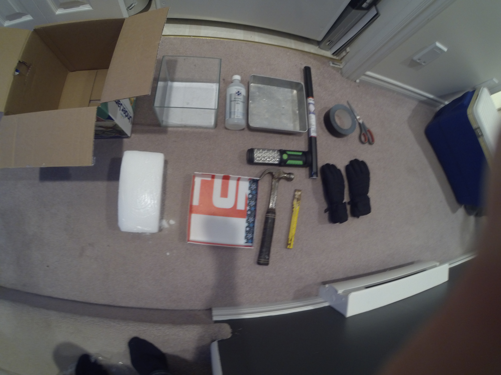
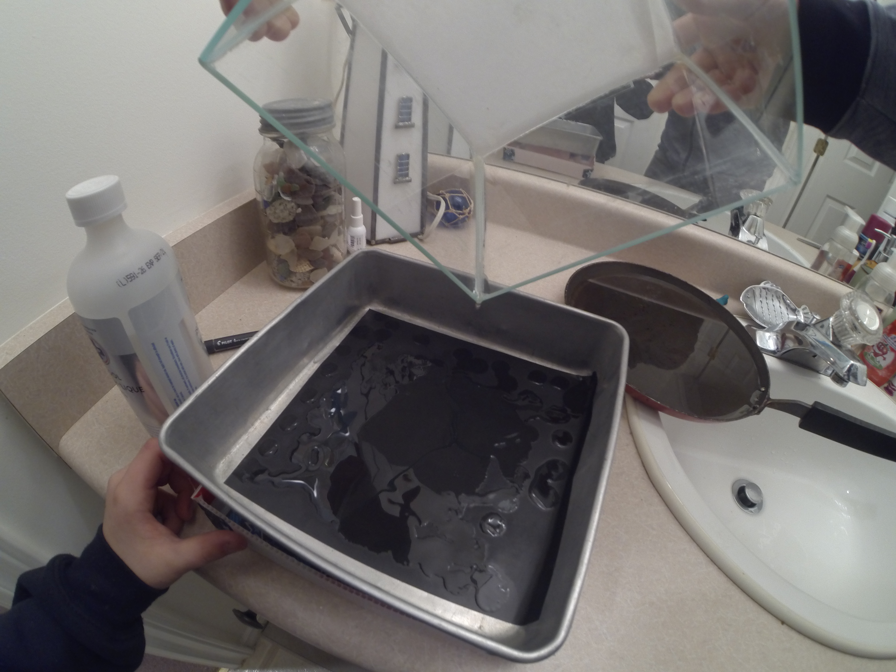
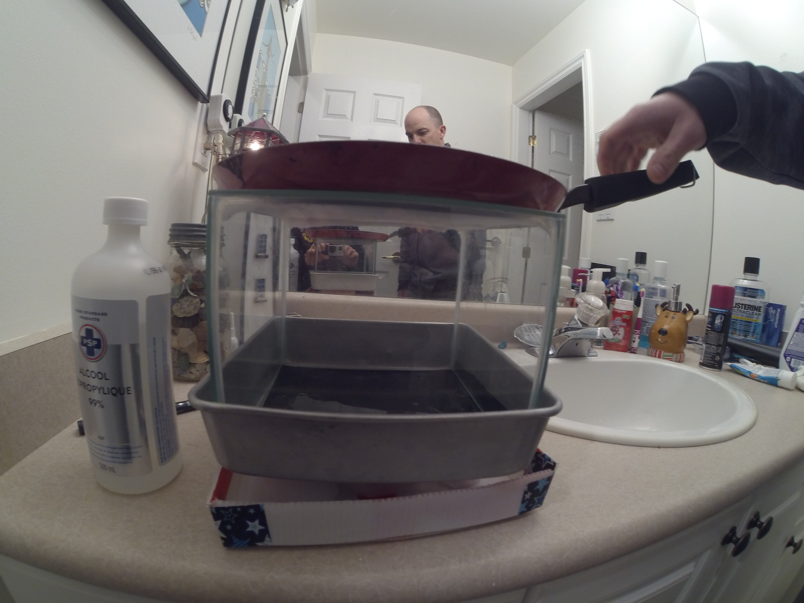

# Cloud Chamber

## Overview

Creating a supersaturated vapor allows ionizing radiation to be seen by the trail it leaves behind.

With a pan of hot water at the top of a chamber filled with isopropyl alcohol, and dry ice at the bottom, the conditions
to see radiation are perfect.

## Media

*Materials used*

*Setting up the isopropyl alcohol*

*Full setup*

*An alpha particle (thick trail) can be seen near the middle of the chamber*
<video src="media/cloud-chamber.mp4" controls style="width:100%; height:auto; display:block;"></video>

