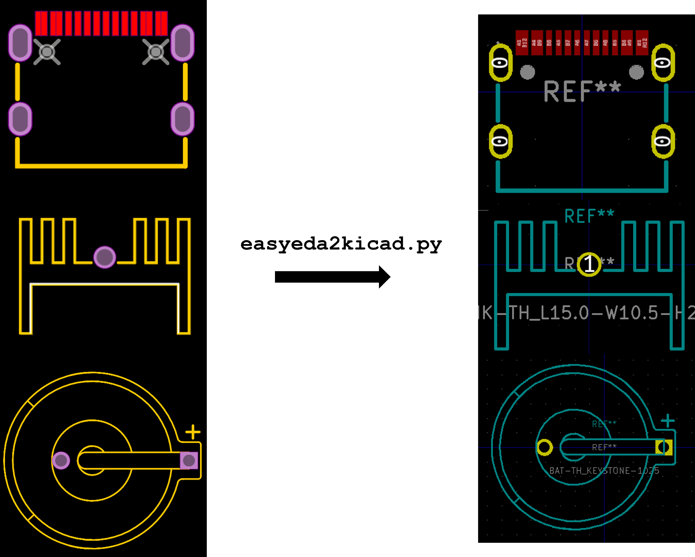

# EasyEDA to KiCad Converter

Most parts I buy for JLCPCB assembly come from LCSC, but I design in KiCad. The upstream [easyeda2kicad](https://github.com/uPesy/easyeda2kicad.py) by uPesy handles the conversion — it pulls EasyEDA's data and writes KiCad libraries.

My fork exists, but it's barely a fork. My only commit on it (`c639590`) changes a newline in `requirements.txt`. The `User-Agent`/`Referer` header fix people sometimes credit to me is actually Steffen Wittemeier's, in upstream commit `95e3e0e`.

The real work lives in [gs-kicad-lib](https://github.com/georgesleen/gs-kicad-lib), which depends on `easyeda2kicad>=1.0.1` and wraps it in the workflow I actually use — interactive importer with fuzzy library and footprint search, generated/existing/no footprint link options, field and procurement metadata normalization, required-field validation, and setup tooling that registers everything with KiCad in one shot.

- [My fork](https://github.com/georgesleen/easyeda2kicad.py)
- [Upstream easyeda2kicad](https://github.com/uPesy/easyeda2kicad.py)
- [gs-kicad-lib](https://github.com/georgesleen/gs-kicad-lib)
