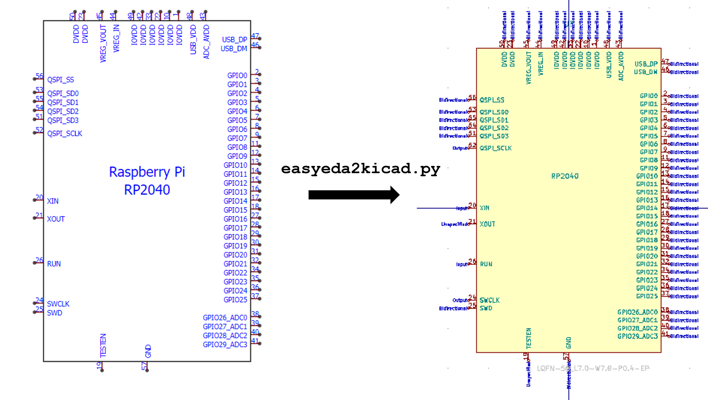

# EasyEDA to KiCad Converter



## Overview

When I design PCBs in KiCad, I source most of my components from LCSC for
JLCPCB assembly. The problem is that LCSC hosts its component models in
EasyEDA's proprietary format, not in KiCad's native format. Manually
recreating symbols, footprints, and 3D models for every part is tedious and
error prone.

easyeda2kicad.py solves this. It is a zero-dependency Python CLI tool that
converts any LCSC component (symbol, footprint, and colored 3D model) into
KiCad library files with a single command.

## Why a Fork

The upstream project by uPesy Electronics is mature and well maintained (v1.0.1,
446 commits, 23 releases). I forked it after EasyEDA's API started rejecting
requests made with the default Python user-agent string. My fork adds a
browser-like `User-Agent` header and a `Referer` header to prevent these
rejections.

## How I Use It

My personal KiCad library, `gs-kicad-lib`, calls easyeda2kicad as a CLI
subprocess. When I need a new LCSC component, I run:

```bash
python -m easyeda2kicad --full --lcsc_id=C2040 --output=gs-kicad-lib
```

This fetches the component data from EasyEDA's API, parses their proprietary
shape format, and exports a KiCad symbol, footprint, and 3D model into my
library. From there, every KiCad project on my machine can reference the part.

The tool also supports batch processing. I can pass multiple LCSC IDs in one
invocation to populate a full BOM at once.

## Technical Details

- **Zero runtime dependencies.** The tool uses only Python's standard library
  (`urllib`, `json`, `ssl`, `argparse`). This lets it run inside KiCad's bundled
  Python, which has limited pip access on some platforms.
- **3D model conversion.** OBJ files from EasyEDA are converted to VRML
  (`.wrl`) with proper material colors. STEP files pass through unchanged.
- **API response caching.** The `--use-cache` flag stores fetched component data
  in `.easyeda_cache/`, so repeated runs for the same part do not hit the API.

## Repository

[github.com/georgesleen/easyeda2kicad.py](https://github.com/georgesleen/easyeda2kicad.py)

Upstream: [github.com/uPesy/easyeda2kicad.py](https://github.com/uPesy/easyeda2kicad.py)
