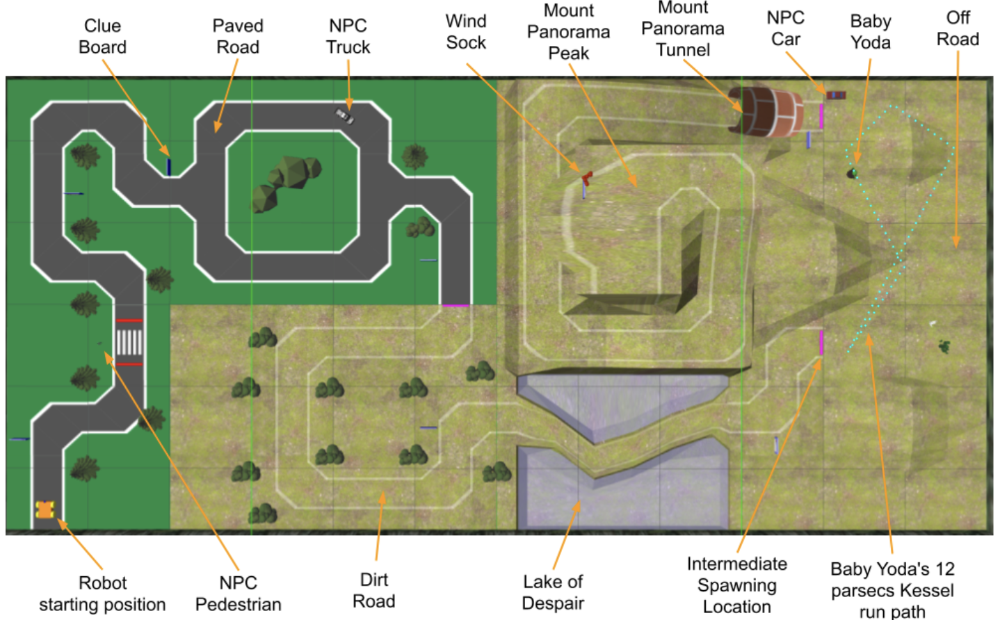
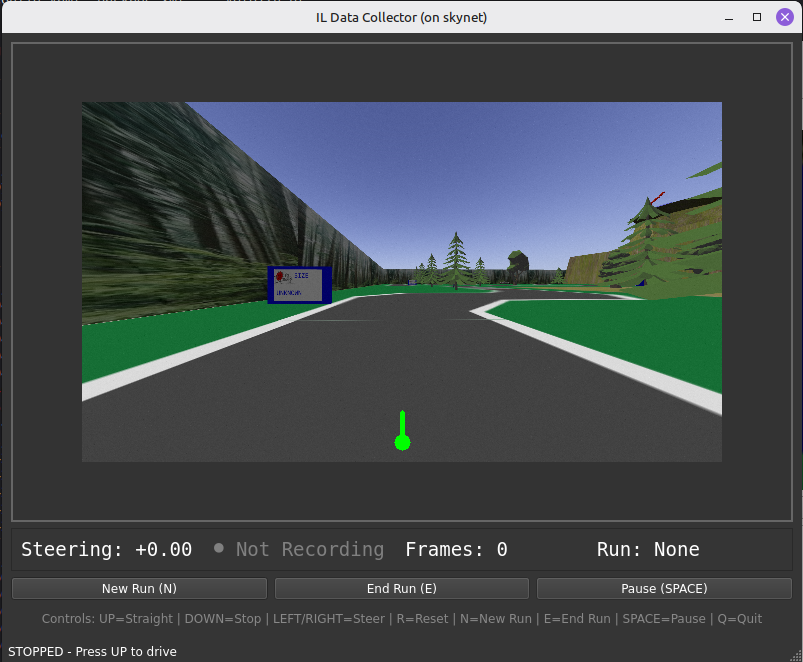
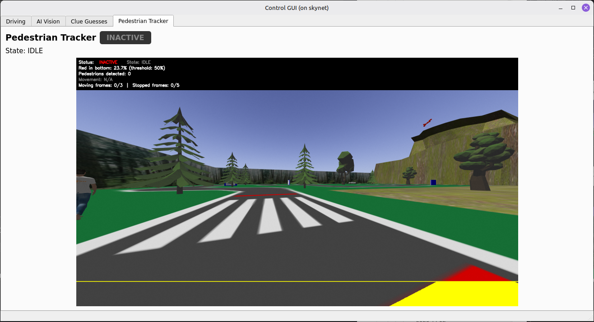
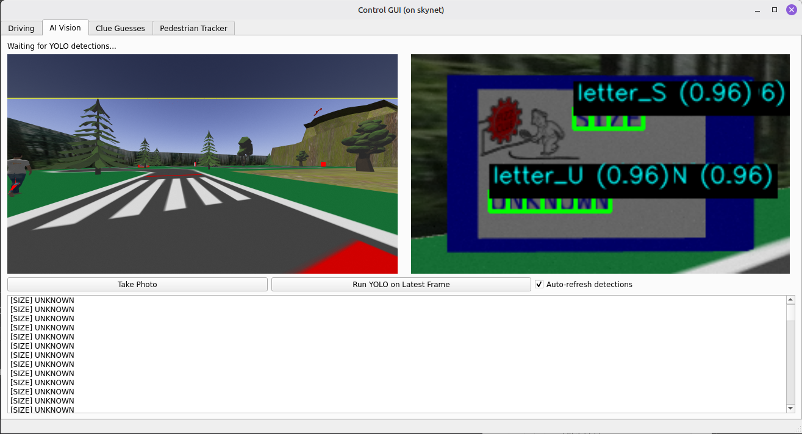
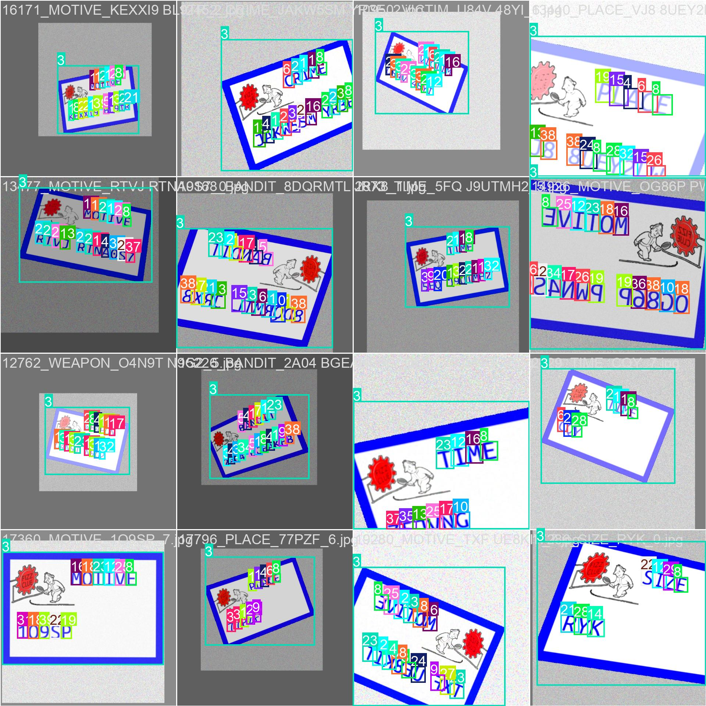
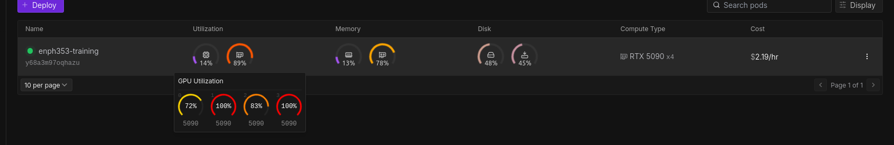
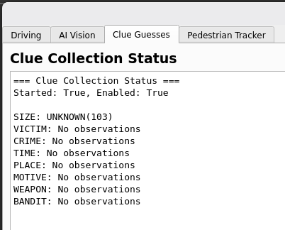

# ENPH 353 - HTTP 418 Autonomous Robot

## Overview
This project was our final competition entry for ENPH 353. The goal was to build a fully autonomous robot in simulation
that could drive around a city map, read clue boards, and avoid pedestrians and vehicles using only its onboard camera.
We named our team "HTTP 418" and built the system as a set of ROS nodes that could be tested independently but run
as one coordinated pipeline.

I worked with Joshua Himmens on the project. Josh focused on the driving stack, and I focused on the vision and OCR
pipeline for clue detection.

This is a small post about the project; the majority of the work is documented in the final report below.

---

## Project Overview
The core loop looked like this:

1. Drive using an imitation-learning model running in an ONNX inference node.
2. Detect crosswalk activity and pause for pedestrians and vehicles.
3. Spot the blue clue boards, crop them, and run OCR to read letters.
4. Aggregate clue detections over time and publish the best guess to the scoring node.
5. Recover from crashes by detecting when the robot is stuck and resetting its pose in simulation.

---

## My Contributions

- Built the clue-detection pipeline (sign detection + OCR) and trained the YOLO-based models.
- Designed the data collection workflow and labeling strategy for clue boards and characters.
- Tuned classical HSV thresholding to reliably crop blue signs before OCR.
- Helped integrate cloud training runs and model versioning into the ROS pipeline.
- Contributed to validation tooling and visual debugging inside the control GUI.

---

## Challenges

1. OCR in the wild: characters were easy to detect in training, but full signs were much harder in context.
2. Performance tradeoffs: we needed fast inference for driving and slower, higher-accuracy models for clue reading.
3. Reproducibility: models, ROS, and GPU dependencies made "it works on my machine" a real risk.

---

## Technical Highlights

### ROS System Architecture
We split the system into nodes for driving, pedestrian tracking, clue detection, clue collection, and crash recovery.
This made the system easier to debug and helped keep slow perception nodes from blocking real-time control.

### Vision and OCR
- Blue sign detection used HSV thresholding to isolate the border and crop signs before OCR.
- A custom YOLO model handled character detection and OCR from the cropped sign image.
- A histogram-based collector fused multiple OCR frames into a stable final clue.

### Training and Tooling
- Imitation learning for driving produced an ONNX model that runs at camera frame rate.
- YOLO training was run on cloud GPUs (Runpod) to speed up iteration.
- We used Weights and Biases for artifact tracking and quick model rollbacks.

---

## Repository

- [Simulation + Control](https://github.com/enph353-2025-team2/ENPH353_HTTP_418)
- [Vision Training](https://github.com/enph353-2025-team2/yolo-vision)
- [Final Report](https://github.com/enph353-2025-team2/final-report)
- [Music Server](https://github.com/enph353-2025-team2/music-server)

---

## Other Media

- _Robot operating video_  
  <iframe width="100%" height="450" src="https://www.youtube.com/embed/4jBRHqV6Ss8" title="Robot operating video" frameborder="0" allow="accelerometer; autoplay; clipboard-write; encrypted-media; gyroscope; picture-in-picture; web-share" allowfullscreen></iframe>

- _Final report_  
  <object data="media/main.pdf" type="application/pdf" width="100%" height="900px"></object>

- _Control GUI and data collection_  
  

- _Pedestrian and vehicle detection_  
  

- _OCR model output_  
  

- _Training dataset snapshot_  
  

- _Cloud training setup_  
  

- _Clue aggregation example_  
  
