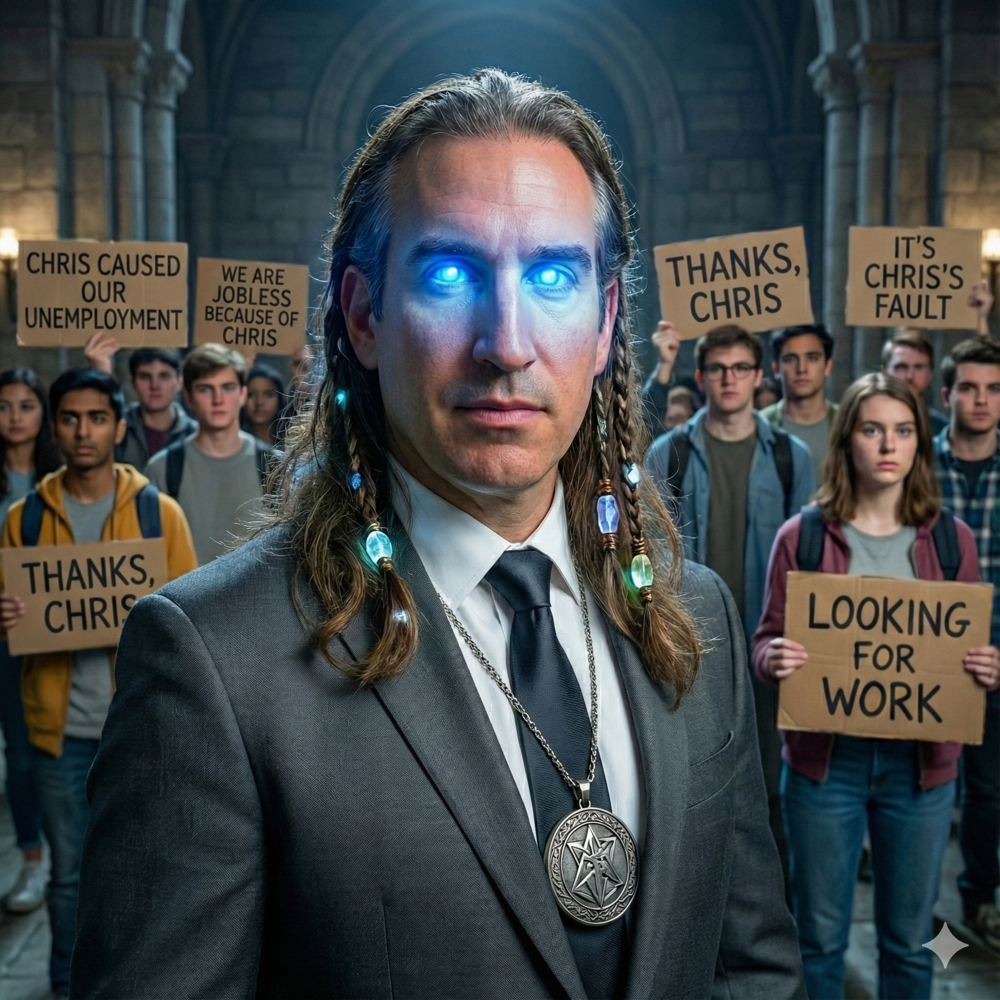

# Fizzbot

I wanted to see if a language model could sound like one specific Discord server instead of a generic chatbot. That meant the whole pipeline — exporting the chat history, keeping who said what, fine-tuning a model, decoding its output, and putting it back into Discord.

## Data

Input is a set of Discrub channel exports. My generator normalizes each message to `{username, content, timestamp}`, sorts by timestamp within a channel, drops empty, URL-only, and mention-only messages, and writes context/target JSONL. Usernames become tokens like `<S0>`/`<S1>`, every message ends with `<EOT>`, and a separate `speaker_map.json` turns those tokens back into `username: message` at inference time. Context never crosses channels.

## Training and inference

The main config fine-tunes Mistral-7B v0.1 with 4-bit QLoRA and LoRA adapters. A tiny CPU config exists for smoke-testing the pipeline without a GPU. The inference CLI can load either the latest run or a specific checkpoint, generate a few turns, and decode the speaker tokens back into readable chat.

## The bot

The Discord side is written in Rust with Serenity. It launches the model process as a child, maps Discord users to speaker tokens through `speaker_map.json`, and exchanges prompts and responses over stdin/stdout. It replies when mentioned, strips the mention, and sanitizes its output so generated text can't ping people.

The repo has Make and Docker targets for each step, from generating training data to launching the bot. The interesting part was less running one training job and more keeping the speaker representation consistent from the raw Discord export through generation and back into the chat.

[github.com/georgesleen/fizzbot-2](https://github.com/georgesleen/fizzbot-2)
