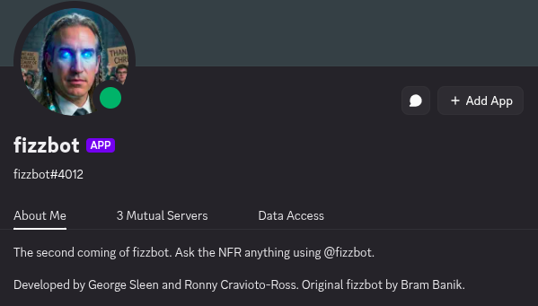
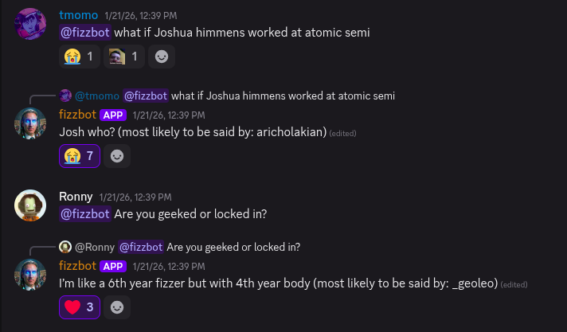

# Fizzbot

## Overview

Fizzbot is a Discord-style chat model trained on the third-year Discord server for my Engineering Physics cohort. The
project started after a proof-of-concept at a Fizz talent show, where my friend Bram Banik demoed a simple test version.
I wanted to see how far I could take the idea if I built the whole pipeline end-to-end: data prep, training, inference
tooling, and an actual Discord bot.

Training runs on my friend Ronny Cravioto-Ross' DGX Spark, and everything else is designed so I can iterate locally
without too much friction.

Under the hood, Fizzbot is a retraining effort on top of an existing base model rather than training from scratch.
I chose Mistral-7B (v0.1) as the base because it gives a strong quality/size tradeoff and works well with QLoRA for
faster iteration.

---

## Project Overview

The basic loop looks like this:

1. Export Discord logs (Discrub JSON).
2. Clean and normalize messages into a consistent schema.
3. Build training examples that preserve speaker identity using tokens like `<S0> ... <EOT>`.
4. Train a causal language model (GPU/QLoRA when available, CPU smoke tests when not).
5. Run inference either in a CLI for quick testing, or behind a Discord bot that replies when pinged.

---

## My Contributions

This project has two halves (Python ML + Rust bot), and I worked across both.

- Built the data pipeline from raw Discrub exports to JSONL training examples.
- Added multi-speaker formatting with `<S#>` tokens and `<EOT>` message boundaries.
- Set up training scripts and YAML configs for both GPU/QLoRA runs and CPU smoke tests.
- Wrote an inference CLI with decoding so model output turns back into readable chat.
- Implemented the Rust Discord bot wrapper that spawns the model process and streams prompts/responses over
  stdin/stdout.
- Added Makefile + Docker helpers so it's easy to run locally or in a container.

---

## Challenges

Some of the tricky parts were not the "train a model" step, but everything around it:

1. Cleaning Discord data without deleting the personality.
2. Preserving speaker identity across long contexts (and making the output decodable again).
3. Keeping the bot integration reliable when the model process is slow, chatty, or crashes.

---

## Technical Highlights

### Data Pipeline

The generator converts Discrub exports into JSONL training examples:

- Normalizes messages into `{username, content, timestamp}`.
- Sorts by timestamp per channel.
- Builds `(context -> target)` examples with randomized context windows.
- Replaces usernames with speaker tokens `<S0>`, `<S1>`, ...
- Appends `<EOT>` end markers to each message.
- Outputs `train_data/training_examples.jsonl` and `train_data/speaker_map.json`.

### Training

Training is driven by YAML configs:

- GPU/QLoRA defaults in `llm/train_config.yaml` (Mistral-7B, 4-bit).
- Retraining uses LoRA adapters instead of a full fine-tune.
- CPU-friendly config in `llm/train_config_cpu.yaml` for fast smoke tests.
- Outputs are stored under `llm/runs/<run_name>/<timestamp>/`.

### Inference CLI

The inference tool supports:

- Running the latest model or a specific checkpoint.
- Decoding `<S#>` tokens back into `username: message` format.
- Interactive prompts for quick testing.

### Discord Bot (Rust)

The Discord bot is built in Rust with Serenity and launches the LLM process as a child task:

- Spawns `make fizzbot` and streams prompts/responses through stdin/stdout.
- Maps Discord users to speaker tokens using `speaker_map.json`.
- Responds when mentioned, strips the mention, and prevents pings.

---

## Repository

[github.com/georgesleen/fizzbot-2](https://github.com/georgesleen/fizzbot-2)

---

## Other Media

