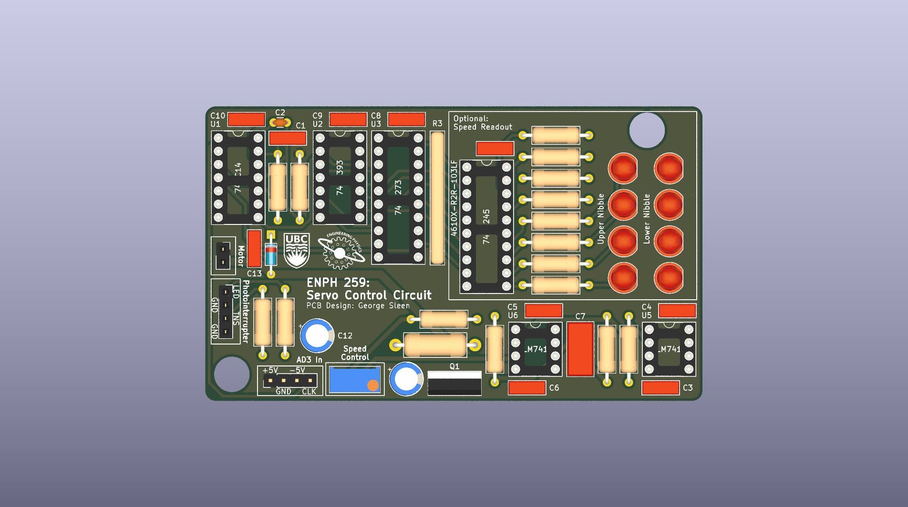
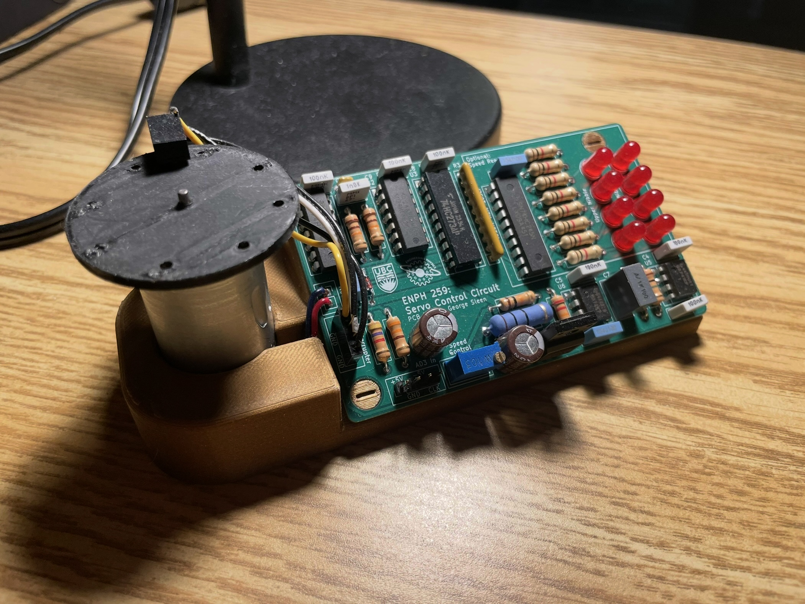

# Continuous Servo Control PCB

## Overview

This project was an extension of my ENPH 259 final project, where I designed and built a custom circuit and PCB to
control a continuous-rotation servo motor.

The goal was to replace the internal control electronics of a hobby servo with a standalone, feedback-stabilized driver
that could be powered externally and provide smoother, more accurate speed control.

---

## My Contributions

- Designed the full control circuit in KiCad, including feedback, comparator, and MOSFET driver stages.
- Created the PCB layout, ensuring signal integrity between the digital counting stages and the analog PI
  controller.
- Assembled and tested the board, debugging issues with clock timing and feedback resolution.
- Integrated the motor with a mechanical disk encoder to generate feedback signals.

---

## Technical Highlights

- **Speed Feedback:** A slotted encoder disk generated pulses, which were counted and latched to represent motor speed
  in binary.
- **Digital-to-Analog Conversion:** The binary counter output was fed into an R-2R DAC, producing an analog voltage
  proportional to measured speed.
- **Reference Comparison:** A comparator compared the measured speed voltage against a reference input.
- **Control Loop:** A PI (proportional–integral) controller smoothed the error signal and stabilized speed regulation.
- **Output Stage:** The processed control voltage drove a MOSFET H-bridge to power the DC motor.
- **Inputs/Outputs:** The system required ±5 V, ground, and a 5 Hz clock signal to operate.

---

## GitHub
[github.com/georgesleen/continous-servo-pcb](https://github.com/georgesleen/continous-servo-pcb)

---

## Media

- *PCB layout render*  
  

- *Assembled board with servo*  
  

---

## Reflection

This project was my first time designing a complete closed-loop motor control system in hardware. It forced me to
combine digital counting and DAC conversion with analog PI control, all integrated on a custom PCB.

Through this build, I gained practical experience in:

- PCB layout for mixed digital/analog systems
- Debugging timing and feedback issues
- Designing a control loop that balances responsiveness with stability

The final system successfully demonstrated that a low-cost servo can be transformed into a continuously controllable
actuator using custom electronics.
