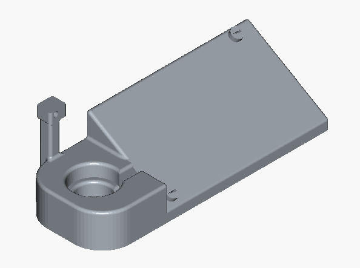

# Continuous Servo Control PCB

An ENPH 259 follow-on: close a motor control loop without a microcontroller in the middle. The board measures shaft motion digitally, converts the count back into a voltage, and closes the loop with an analog PI controller and a MOSFET H-bridge driver.

The sensor is a slotted disk on the shaft. Pulses feed a counter that's latched right before a periodic reset, giving a sampled measure of rotational speed. An R-2R ladder converts the latched binary value to a voltage; that voltage is compared to a reference, and the error goes through the PI stage before driving the motor. Digital counting, analog control, one board. The system needs external `+5 V`, ground, `-5 V`, and a `5 Hz` clock, since the clock sets the counting window.

I built and powered up the board, but I didn't save a step response or any other closed-loop measurement, so I can't put a real accuracy number on it. What I have is a board whose stages all produce the expected signals on the bench.

_Board render:_

_Schematic (page 1):_

_PCB front (page 1):_

[github.com/georgesleen/enph259-servo-pcb](https://github.com/georgesleen/enph259-servo-pcb)
