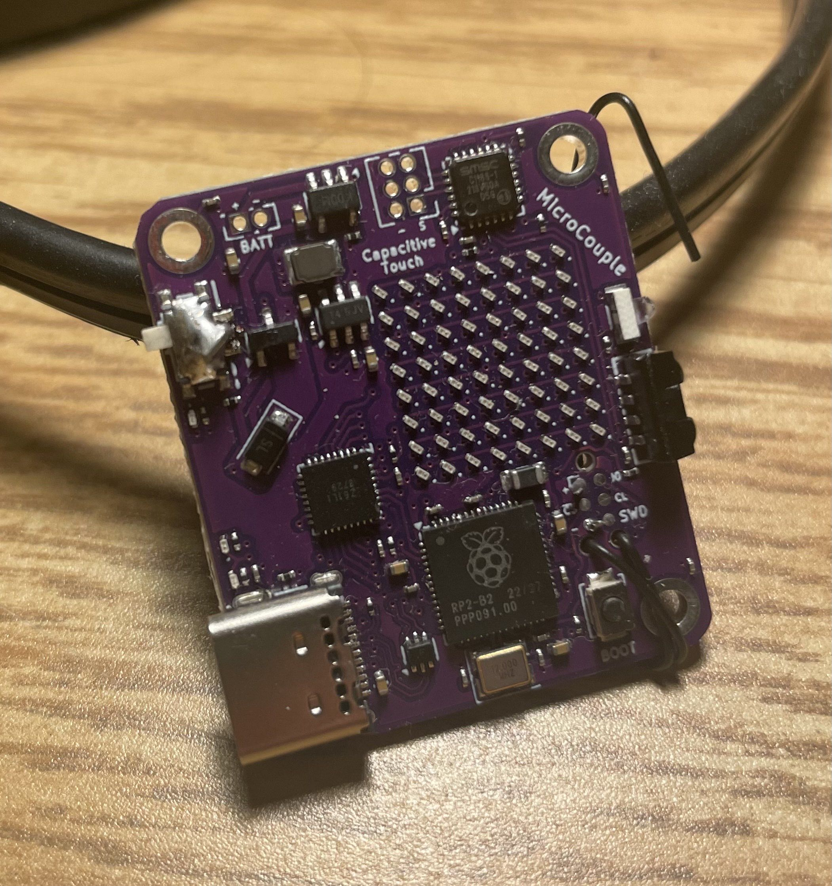

# Microcouple

## Overview

Microcouple is a pair of RP2040-based boards that communicate wirelessly over infrared. Each board includes an LED
matrix display, capacitive touch inputs, IR transmit/receive hardware, USB-C connectivity, and on-board LiPo charging.

---

## Notes

On my first revision, I wasn’t careful enough reading the documentation or studying the reference designs. I saw “SoC”
and assumed I could just place the chip and go. That was a mistake: the QSPI lines were essential, and I needed to add
external storage on those lines for it to work properly. On the second revision I also caught that the EEPROM was
missing and fixed that. It was a good reminder that “system on chip” doesn’t mean “system on board.”

---

## Contributions

- Designed the schematic and PCB in KiCad, integrating RP2040, IR transceiver, USB-C, and power management.
- Implemented the LED matrix drive and capacitive touch sensing interfaces.
- Validated IR communication between boards and basic UI interactions.

---

## Technical Highlights

- **Wireless IR Link:** Hardware for bidirectional IR communication (NEC protocol at ~38 kHz).
- **Display:** Integrated LED matrix for animations and status feedback.
- **Input:** Capacitive touch pads for simple user interaction.
- **Power:** USB-C input with LiPo charging and battery operation.
- **Firmware:** Core bring-up and protocol work in progress.

---

## GitHub

[github.com/georgesleen/microcouple](https://github.com/georgesleen/microcouple)

---

## Media

- *Board photo*  
  

- *Schematic (page 1)*  
  
