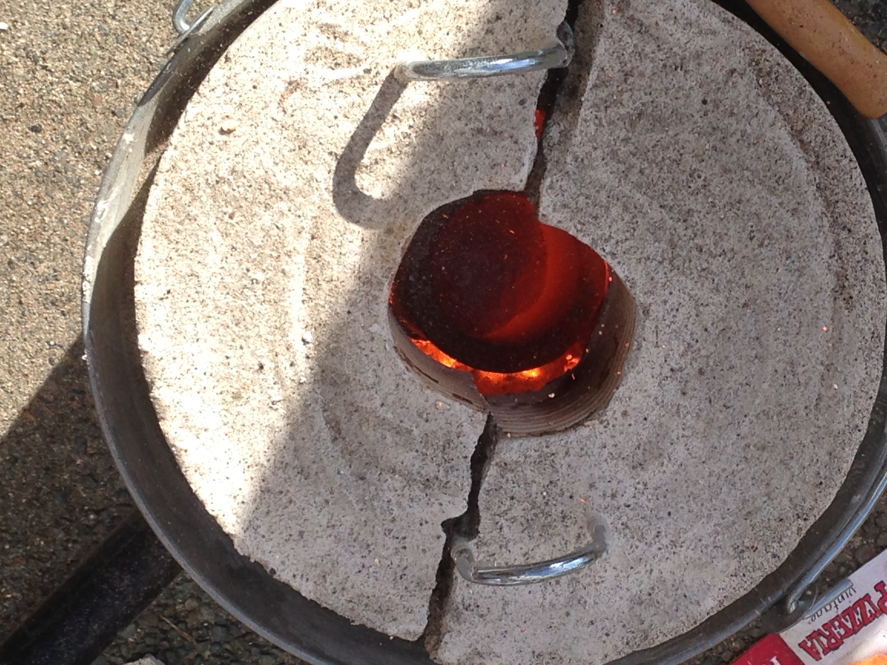
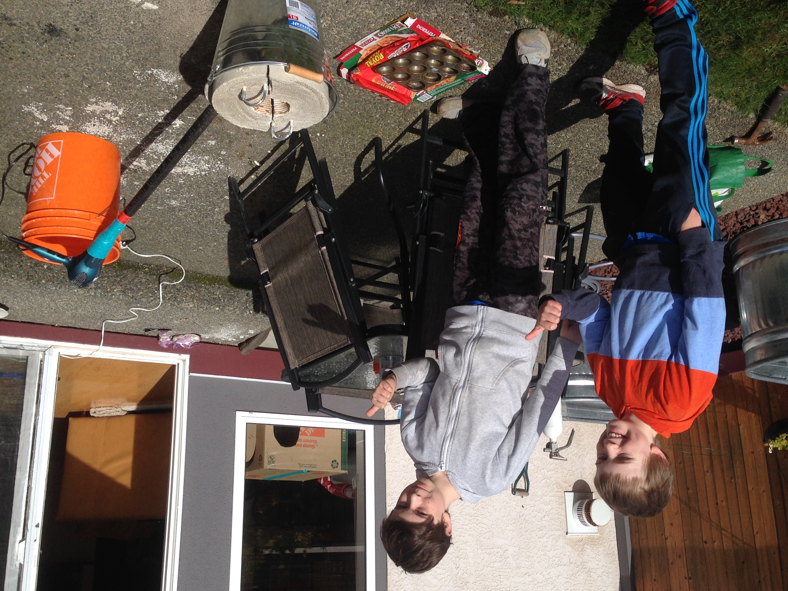

# Mini Metal Foundry

## Overview

Inspired by a [YouTube video](https://www.youtube.com/watch?v=hHD10DjxM1g),
my brother and I built a simple metal foundry in our backyard from plaster of paris, a steel pipe, and a metal bucket.

Powered by a hair dryer and charcoal, it was hot enough to melt down aluminum cans. We used this molten aluminum and a
baking tin to create cast aluminum ingots.

## Media

*Active foundry*

*Setup*

