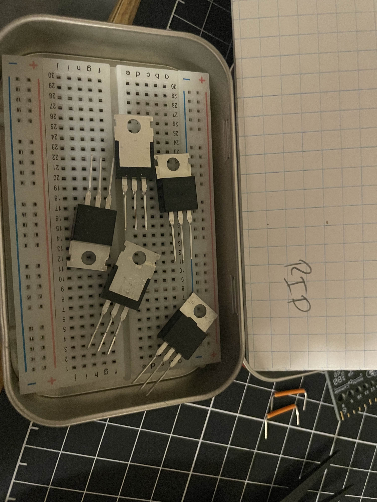
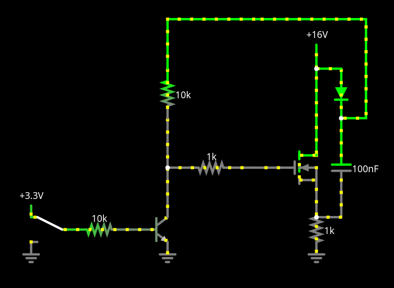
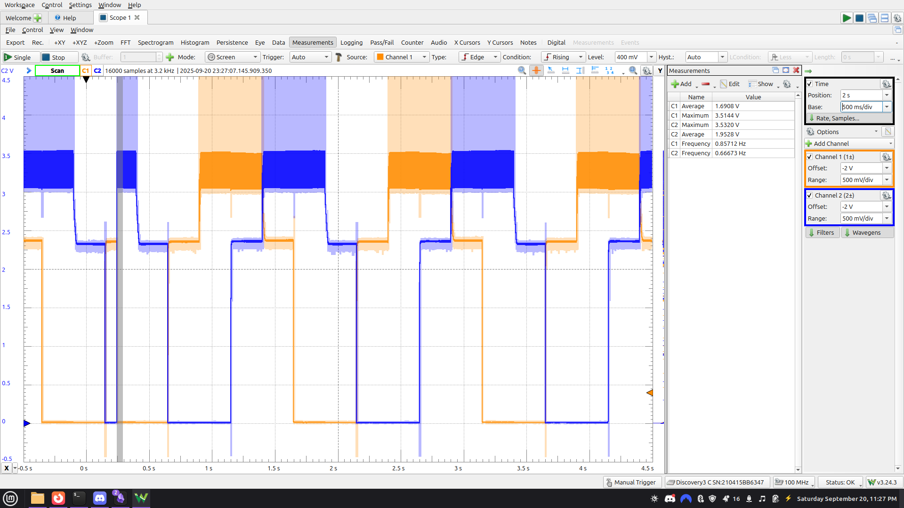
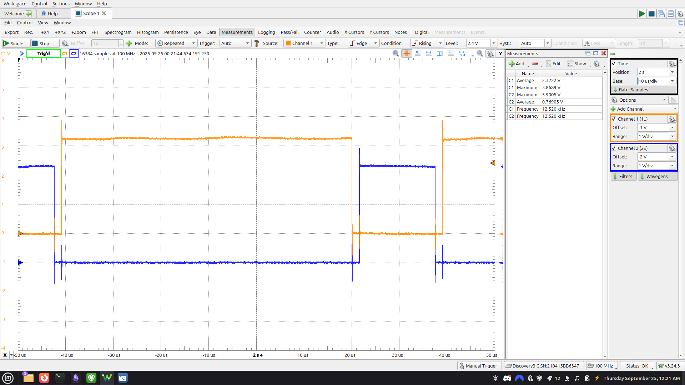

# Open ESC

## Overview

This project is an attempt to build a fully open-source electronic speed controller (ESC) for sensorless brushless DC
motors.  
The project has two major goals:

1. **Hardware:** design the power electronics, gate drive, and commutation circuitry from scratch
2. **Firmware:** implement the ESC logic in embedded Rust using the Embassy async framework for the RP2040

The long-term vision is to create a minimal, well-documented ESC that others can learn from or extend.

---

## GitHub

- [Hardware – georgesleen/open-esc-hardware](https://github.com/georgesleen/open-esc-hardware)
- [Firmware – georgesleen/open-esc-firmware](https://github.com/georgesleen/open-esc-firmware)

---

## Development Log

### September 20, 2025 – First Drive Experiments

- **Initial Plan:** Boost converter circuit to power the high-side MOSFETs.
- **Result:** Able to drive LEDs and phases under PWM.
- **Problem:** Consistently killed high-side FETs during switching.

- **New Plan:** Switched to a bootstrapped high-side drive.
    - Tested with
      simulation ([Falstad link](https://www.falstad.com/circuit/circuitjs.html?ctz=CQAgjCAMB0l3BWcMBMcUHYMGZIA4UA2ATmIxAUgpABZsKBTAWjDACgAXEYwkTFcDRp8MAqhBgIExBGAQY8eIQQwyo0QmBqRZCIpGyFMkcmDggAJgwBmAQwCuAGw5sATt179wn0VGTw2AGVvEQEmbAEvcRA7RwBnBj8UNgAlEHDIhF4MvhRhKiptEGxoegL1BDYAc3SIvkVagVx8qGrBYRQGrWFmv0g2a3q8cGImwxGmgTBoJBhIZPcULIn2lfEAgHdVpd5utbYtvbBR1bBO1vcj873CFrMAgGNiwmGz4cNhndpwWHg--7gYGYpgQM06slYhhQ2AUBnUgNaW2w4zAGF4yN2536SPGaHeuLyiOKuOWHz4y36Fmew1u1PA5wEVjsThcaQxIFp7LAvHKRW5fQqB2JvE5KKxQrJopF+Ta7M6+PRkBa-Xccoacop-mx5N2J3l+xxnkJGp5Epe9OG2nE4q2VottHMBSFdqoXydWzdq3dXtWtP6AHs+BA-Q7iMMYEZZr84GRCFklkkg8U2EA)).

- **Working Commutation:** After adjusting capacitor values (100nF bootstrap instead of 10 µF), achieved clean
  phase-to-phase commutation.

---

### September 23, 2025 – Complementary PWM

- Set up complementary PWM with deadtime insertion.
- Scoped waveforms showing expected high-side/low-side switching.

  

---

## Firmware Direction

The firmware is being developed in Rust using the [Embassy](https://github.com/embassy-rs/embassy) async framework
for the RP2040.

- Embassy provides async task scheduling, which allows clean handling of concurrent operations like commutation
  updates, current sensing, and telemetry.
- Sensorless back-EMF zero-crossing detection will be added as an async task running alongside the commutation driver.

This approach not only makes the firmware cleaner but also gives me a deeper understanding of async Rust and low-level
microcontroller peripherals.

---

## Next Steps

1. Attach a BLDC motor and test commutation under load
2. Build out basic Rust firmware tasks (commutation + PWM sync, back EMF detection)
3. Implement back-EMF sensing for sensorless startup

---

## Reflection (So Far)

Even at this early stage, this project has already reinforced how subtle power electronics design can be. Small
choices in bootstrap capacitor size, gate resistance, or timing lead to completely different behavior, from “nothing
works” to “burnt MOSFETs” to “stable commutation.”

On the firmware side, working with Embassy-RP has been a good forcing function for structuring tasks cleanly rather
than writing ad-hoc loops. I expect this to pay off once the motor is actually spinning and timing becomes critical.
