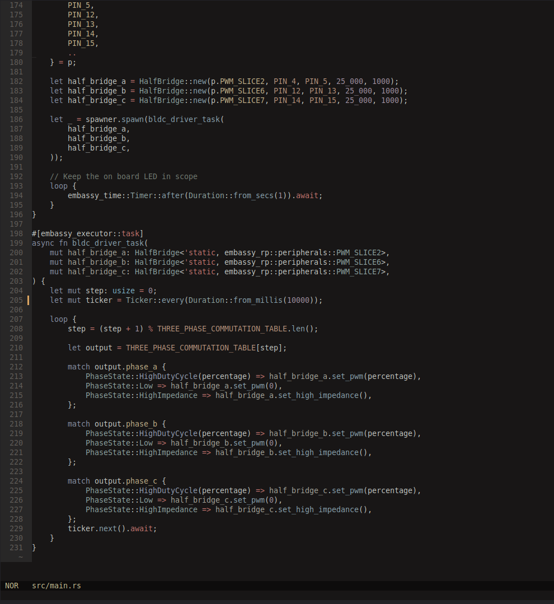
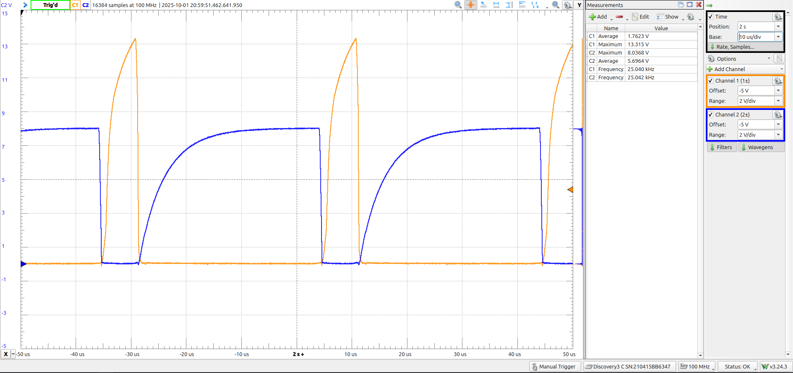

# Open ESC

I've used a lot of brushless motors without really knowing what happens inside the ESC. Open ESC is an attempt at doing both halves myself — a discrete three-phase power stage and Rust firmware for the RP2040 using [Embassy](https://github.com/embassy-rs/embassy).

## Hardware

The first version fed the high-side gates from a boost converter. It could drive LEDs and produce phase waveforms, but it kept killing the high-side MOSFETs on switching.

I switched to a bootstrap high-side drive and iterated on the bootstrap capacitor (initially 10 µF, ended up at 100 nF). That got clean phase-to-phase commutation on the bench.

Next problem was shoot-through. Complementary high-side/low-side PWM with an explicit dead-time offset, checked on the scope:

<video src="media/bootstrap-led-commutation_2025-09-20.mp4" controls style="width:100%; height:auto; display:block;"></video>

## Firmware

The firmware is Embassy on the RP2040. It has a three-half-bridge driver, complementary PWM with dead-time calculation, and a six-step trapezoidal commutation table. I've also messed with sinusoidal commutation. Neither has sensorless feedback yet.

Back-EMF zero-crossing detection, reliable sensorless startup, and closed-loop timing are all still ahead, and there is no saved test of the controller actually turning a motor under load. So far there's a power stage and firmware that produce the expected gate and phase waveforms on the bench.

- [Hardware](https://github.com/georgesleen/open-esc-hardware)
- [Firmware](https://github.com/georgesleen/open-esc-firmware)
