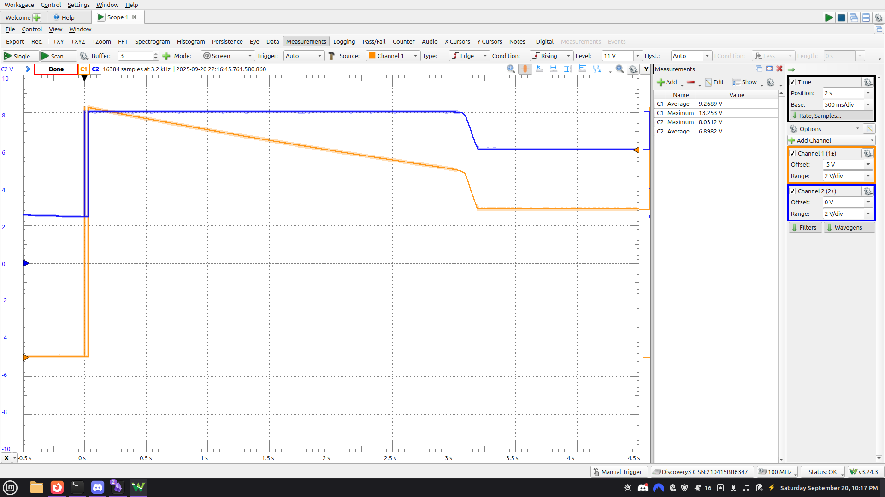
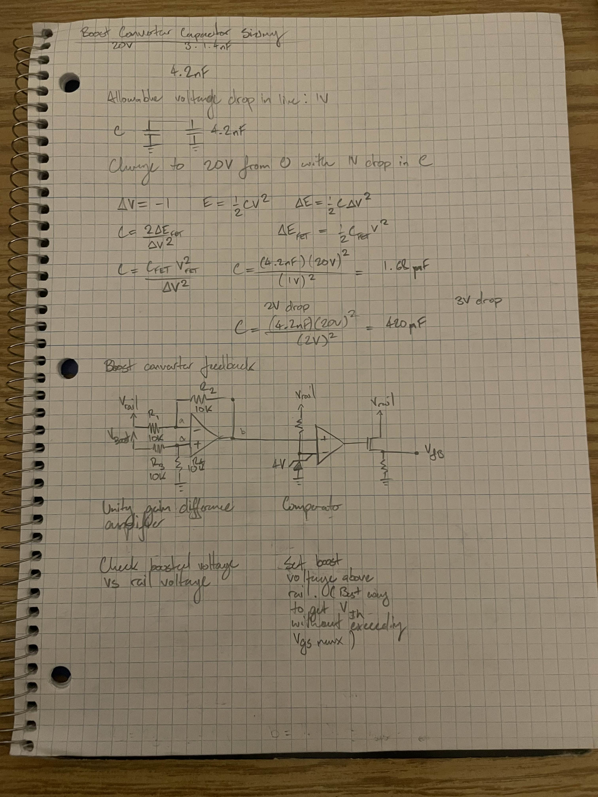
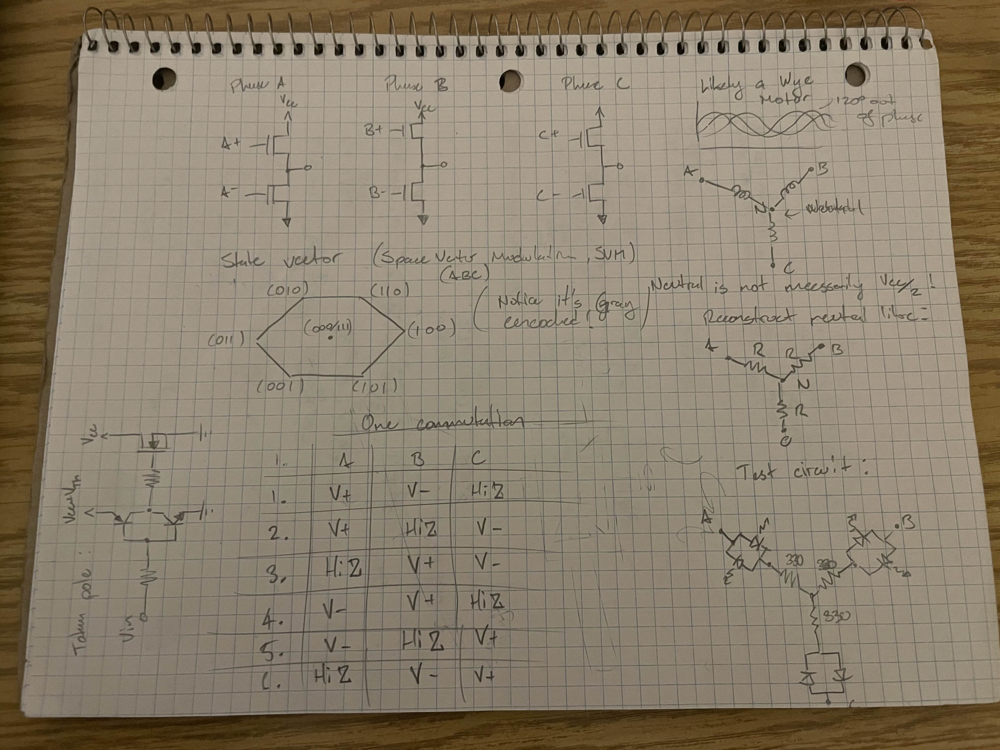
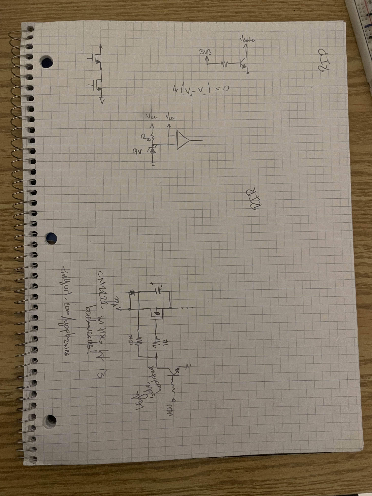

# Open ESC

# IN ACTIVE DEVELOPMENT

## Goals

- Build an ESC to drive sensorless brusless dc motors.
- Learn embedded Rust.

## Media

### GitHub repositories

[github.com/georgesleen/open-esc-hardware](https://github.com/georgesleen/open-esc-hardware)

[github.com/georgesleen/open-esc-firmware](https://github.com/georgesleen/open-esc-firmware)

### Logbook media

#### Bootstrap & Commutation Tests

<video controls src="./media/bootstrap-led-commutation_2025-09-20.mp4"></video>

#### Circuit / Drive Tests
<video controls src="./media/drive_2025-09-20.mp4"></video>
<video controls src="./media/led-inverter_2025-09-20.mp4"></video>

<video controls src="./media/pwm-drive_2025-09-20.mp4"></video>

#### Paper Notes / Diagrams

#### Failures / Debugging

