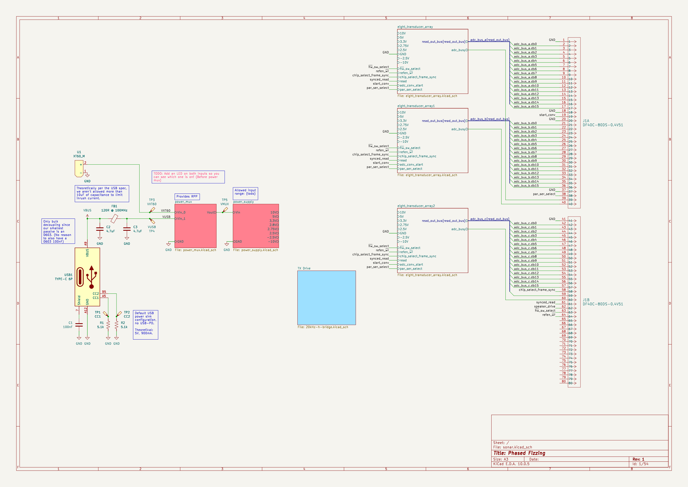
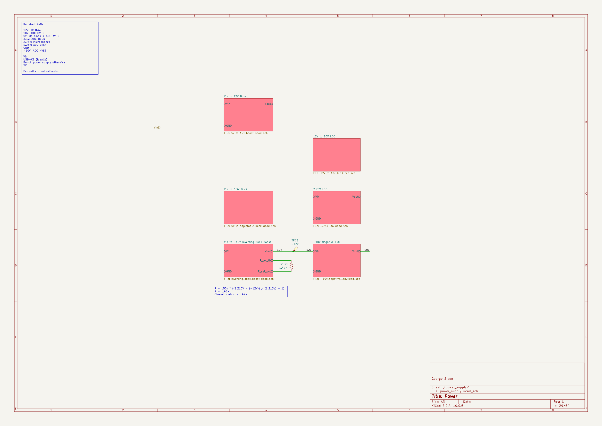

# Phased Array Sonar

This is a custom ultrasonic sonar system that Josh Himmens and I are designing
from scratch in KiCad. The board transmits and receives ultrasonic pulses
through a phased array of piezoelectric transducers for object detection and
distance measurement.

The project lives in a monorepo with the main board, a dev board for prototyping
TX/RX circuitry, a shared KiCad component library, and a standalone SPICE
simulation for the receive amplifier.

## Transmit

I built the H-bridge driver circuit that generates the 20 kHz drive signals for
the transducer array. The array uses Murata MA40S4S piezoelectric ultrasonic
transducers (40 kHz, 10 mm diameter, 20 Vp-p max input). The top-level
schematic instantiates the 8-element array three times, for 24 elements total.

## Receive

Josh designed the RX chain. SPV0142LR5H-1 MEMS microphones (Knowles, analog
omnidirectional) feed into a multi-stage amplifier. Each group of four MEMS mics
connects to a quad pre-amplifier, and each element has its own RX amplifier
channel. The pre-amp runs at a gain of 21 with a 120 MHz GBP op-amp.

A standalone SPICE simulation project (`rx_amp_sim/`) lets us iterate on the RX
amplifier design without dragging the full schematic into simulation.

## Power tree

_Power supply hierarchy:_

I designed the full power tree. It supports two input sources through a power
mux with ideal diode ORing:

- USB-C (5 V / 900 mA)
- XT60 connector (battery or bench supply)

From the input, the tree generates every rail the system needs: 5 V to 12 V
boost (TPS55340), inverting buck-boost for a negative rail (TPS63700), 3.3 V
adjustable buck for digital logic, negative 10 V LDO (LM337), 12 V to 10 V
LDO, and a 2.75 V LDO.

The inverting buck-boost was the hardest part. The component calculations for
the inductor and feedback resistors took multiple iterations. I kept the old
revision (`inverting_buck_boost_OLD.kicad_sch`) alongside the current one
because my commit message at the time was "Do some more questionable math for
the inverting buck boost" and I wanted the reference.

## Shared library and tooling

The `sonar-library/` directory has over 40 symbols, 19 custom footprints, STEP
models for the connectors, and SPICE models for the TVS diode and boost
converter. I wrote a Python setup script (`setup-kicad.py`, PEP 723 inline
metadata) that registers the library with KiCad's global tables and sets path
variables. It refuses to run while KiCad is open to avoid config clobbering.

Getting library resolution to work across machines was its own problem. KiCad
has two layers of resolution: global (via `kicad_common.json` path variables)
and project-local (via per-project `sym-lib-table`). The setup script and
careful use of `${KIPRJMOD}` relative paths keep them from fighting.

I also merged the previously separate sonar-v1-pcb and tx-rx-dev-board
repositories into the monorepo.

## Repository

[github.com/fizzy-sonar/sonar-hardware](https://github.com/fizzy-sonar/sonar-hardware)
