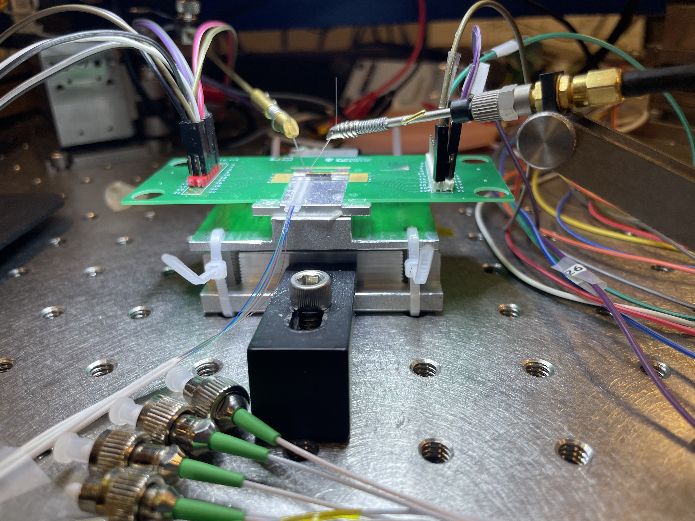
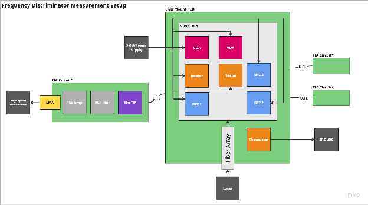
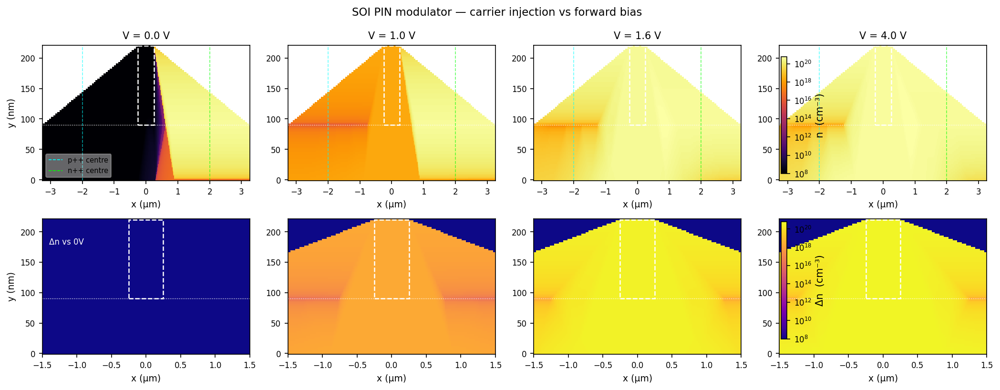
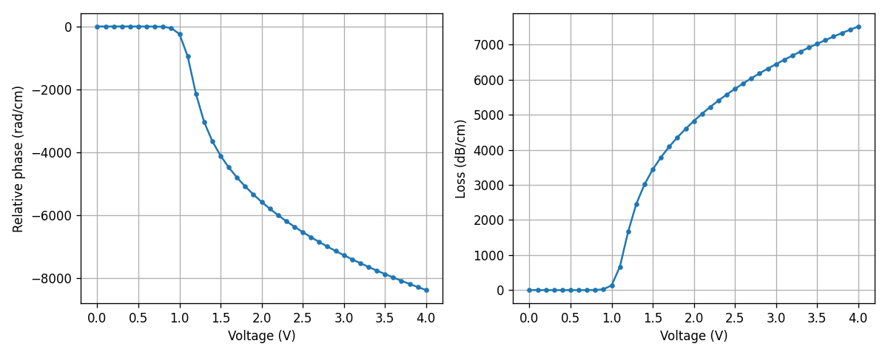

# Photonics Lab

## Overview

I work in a silicon photonics research lab at UBC through the SiEPIC program.
The project is to bring up an integrated frequency discriminator chip and use
it to measure laser linewidth.

The chip is a Mach-Zehnder interferometer (MZI) fabricated by Advanced Micro
Foundry (AMF) in a 220 nm silicon-on-insulator process. It converts a laser's
frequency fluctuations into an intensity signal at a balanced photodetector
pair. From the detected signal, the frequency-noise power spectral density
gives the linewidth.

## How It Works

The discriminator is an unbalanced MZI: the input splits, one arm picks up a
delay, and a 2x2 multimode-interference coupler recombines the two arms onto a
balanced photodiode pair. The operating point is the zero-difference fringe,
where intensity noise drops out and phase sensitivity is maximal.

A PIN junction variable optical attenuator (VOA) on the short arm equalizes the
two arms. A heater tunes the interferometer phase to hold quadrature. The
balanced differential photocurrent is then proportional to the laser's
frequency fluctuations, and the power spectral density of that signal gives the
frequency-noise spectrum.

## My Work

I wrote the experimental proposal for the bring-up, covering the full
measurement chain:

1. **Reference laser characterization.** Run each test laser (a benchtop
   tunable source at 1550 nm and a telecom DFB in a butterfly package) through
   the OEwaves OE4000 reference analyzer and a delayed self-heterodyne setup.
2. **Electronics and PCB validation.** Bring up the TIA (transimpedance
   amplifier) board using an OPA858 decompensated op-amp, and the PD-bias board.
3. **Optical I/O.** Couple light into the chip through edge couplers and confirm
   the on-chip photodetectors respond.
4. **Loss matching.** Bias the PIN attenuator to equalize the two interferometer
   arms.
5. **MZI interference and quadrature lock.** Bring the arms into interference
   and adjust the heater to hold the zero-differential operating point.
6. **Discriminator calibration.** Fix the volts-per-hertz slope with a known
   frequency-modulation tone from an AWG.
7. **Linewidth extraction.** Recover the frequency-noise PSD, apply the
   beta-separation line, and extract the FWHM linewidth.

## VOA Simulation

As a supporting piece, I ported the lab's Lumerical CHARGE and MODE simulation
pipeline to open-source Python tools (DEVSIM for drift-diffusion, femwell for
the eigenmode solve). The simulation models the PIN VOA's cross-section: a
220 nm SOI rib waveguide with lateral p++ and n++ implants, sweeping forward
bias from 0 to 4 V and computing the effective index change from injected free
carriers.

_Carrier density maps at four bias points:_

_Effective index vs. voltage (Python pipeline vs. Lumerical reference):_

## Equipment

The lab bench includes a Keysight B2902A source-measure unit pair, an OEwaves
OE4000 linewidth analyzer, a Rigol DG1022 AWG, and an ILX LDM4980 laser diode
mount with temperature control.

## Repository

VOA simulation: [github.com/georgesleen/frequency-discriminator-voa-simulation](https://github.com/georgesleen/frequency-discriminator-voa-simulation)
