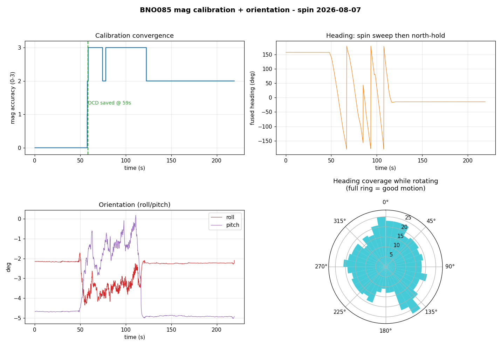

# PLRS-IMU

This is my main project on [UBC Sailbot](/projects/ubc-sailbot/). I've written
173 of the 175 commits, and the codebase is about 17,000 lines across C++
firmware, Python simulation, and tests. The goal is heading accuracy within
2 degrees by fusing an IMU and dual-antenna GNSS through an Extended Kalman
Filter.

## The hardware

The MCU is a Raspberry Pi RP2040 (Pico), with RP2350 support for the newer
boards. For GNSS I use a Septentrio mosaic-go H, the dual-antenna variant
that gives heading from the baseline between two antennas.

The IMU was originally an Xsens MTi-3. That sensor died, and I replaced it
with a BNO085. I wrote a complete SHTP/SH-2 protocol layer from scratch for it
(the Xbus protocol layer for the Xsens was already done). Here is a
magnetometer calibration capture from the BNO085, showing the heading sweeping
through all directions and the coverage rose filling out:

The PCB is my own design in KiCad. It carries the RP2040 (or RP2354), the IMU,
a debug probe header, and overvoltage protection.

## The filter

The firmware runs FreeRTOS on the RP2040. I wrote it in C++23, and all the
protocol layers (Xbus, SHTP/SH-2, SBF/NMEA) compile and run tests under
plain `g++ -std=c++23` on the host. That makes iteration much faster than
flashing to hardware every time.

The EKF started as a 2-state filter (heading + gyro-Z bias) and grew to 7
states: heading, roll, pitch, 3-axis gyro bias, and magnetometer offset. Each
expansion was driven by a concrete problem.

**Heel coupling.** The original filter integrated body-Z gyro directly into
heading. That works when the boat is level, but the moment it heels, body-Z
gyro is not pure yaw rate anymore. A boat at 30 degrees of heel, sailing
straight, shows a non-trivial gyro-Z reading from pitch-rate coupling. The
filter integrates that into heading, and the drift looks like a slow yaw bias.
GNSS keeps pulling it back, so it does not catastrophically fail; it just
quietly degrades. This was the bug the previous sailbot IMU had. I fixed it by
promoting roll and pitch into the EKF state and projecting the body gyro
through the ZYX Euler kinematic matrix before integrating.

**Gimbal singularity.** Near 90 degree pitch the heading kinematics blow up
(sec(pitch) goes to infinity). A boat never trims there, but bench handling and
knockdowns can. Without a guard, the covariance goes to NaN and never recovers.
I clamped the pitch feeding the rate maps and added a `heading_trustworthy`
flag that the rudder controller checks before steering.

**Float32 P degradation.** On the RP2040 everything is single-precision. I
found that during long GNSS outages the covariance matrix diagonal could grow
large enough that the heading and mag-offset sigma estimates lost precision.
The fix is a sigma cap that prevents the covariance from drifting into the
range where float32 arithmetic stops being meaningful.

**P symmetry.** After each measurement update the covariance matrix can pick up
small asymmetries from floating-point rounding. Over many updates these
accumulate and the filter diverges. I added a re-symmetrize step after every
update.

## GNSS bring-up

Getting the Septentrio mosaic-go H to produce heading turned into a multi-week
debugging effort. The first unit tracked satellites on the main antenna but
reported zero on the aux, even in clear sky. I wrote a diagnostic script
(`mosaic_diag.py`) to parse MeasEpoch, AuxAntPositions, AttEuler, and RxError
blocks. The script showed AUX1 tracking 0 to 1 satellites while MAIN tracked
27 to 28. The unit went back as an RMA.

The replacement unit was different but still broken. It tracked satellites on
both antennas (3 to 6 on aux, 14 to 18 on main), but the attitude solve still
failed. I dug into the MeasEpoch data and found the real problem: zero common
satellites between the two antennas. Attitude needs double-differenced
observations, which need the same satellites visible on both antennas at the
same time. My diagnostic script had been counting only Type1 sub-blocks and
missing the Type2 sub-blocks where the aux antenna reports most of its
measurements. Once I fixed the parser, the common count jumped to 26, and
heading locked at 241 degrees with 0.15 degree stability.

The Septentrio hardware manual is explicit that ANT_2 is AC-coupled and
unprotected, unlike ANT_1. I suspect the first unit was damaged by hot-plugging
the SMA while the 5V bias was live. I added a procedure: power the receiver
down before connecting antennas, discharge each coax before mating.

## GNSS outage handling

The question that started a whole investigation: what happens when GNSS drops
out? The magnetometer should hold heading, but how well?

I ran a full audit. The filter already fails safe: the rudder gates steering
on `heading_valid` (sigma under 5 degrees, pitch under 80 degrees). In
simulation, a GNSS outage pushes heading sigma past 5 degrees within about
16 seconds, so the rudder stops trusting the heading before any large error
builds. The large drift that happens during a long outage (tens of degrees)
occurs entirely after heading is already flagged invalid.

The real lever is usable coast time. The loose `q_offset` that correctly
absorbs magnetometer wander during normal operation is the same parameter that
lets confidence decay in 16 seconds. I added an opt-in `q_offset_outage` that
pins the mag offset during a GNSS gap: with a clean magnetometer, heading holds
under 1 degree for a full 5-minute outage and stays valid. With a dirty
magnetometer, pinning makes the filter confidently wrong, so the knob defaults
to off and gates on a characterized mag.

_EKF holding heading through a GNSS outage:_

_Same scenario at 20 degree heel with a body-Y gyro bias:_

_Peak heading error across the full attitude envelope during a 30 s outage:_

## The simulation

The same C++ EKF code that ships on the RP2040 is bound into Python via
nanobind. I can run the filter offline against synthetic sensor data, and the
tuning values transfer faithfully because it is literally the same compiled
filter running in both environments. The decision to use FFI instead of
reimplementing the filter in Python was the first important call. If the Python
filter differs from the C++ filter by a single ULP per step (different float
promotion, a numpy summation in a different order), Q values picked offline do
not transfer.

The sim has timeseries plots (truth vs. estimate with 1-sigma bands), a 3D boat
visualization with truth and EKF-estimate hulls overlaid, and the drift sweep
heatmap above. A live telemetry monitor reads real-time UART output from the
board and plots attitude, heading, and GNSS status.

## The PCB

_PCB front:_

_PCB back:_

The board connects to the Septentrio GNSS module and talks to the rudder
controller over a COBS-framed serial link that I designed for the
[com-module-firmware](/projects/ubc-sailbot/).

## Repositories

- Firmware and simulation: [github.com/UBCSailbot/PLRS-IMU](https://github.com/UBCSailbot/PLRS-IMU)
- PCB: [github.com/georgesleen/polaris-imu-pcb](https://github.com/georgesleen/polaris-imu-pcb)
