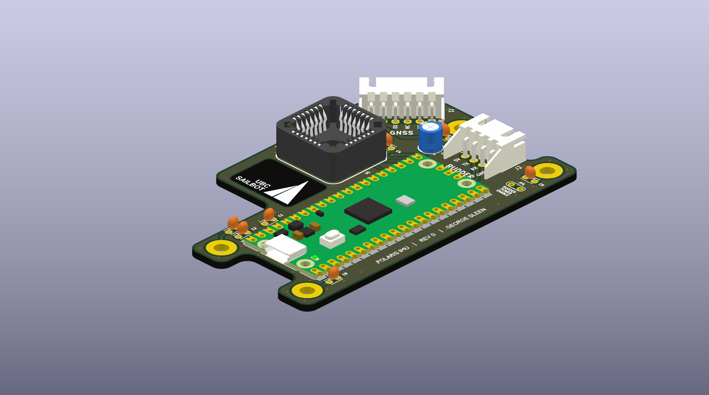
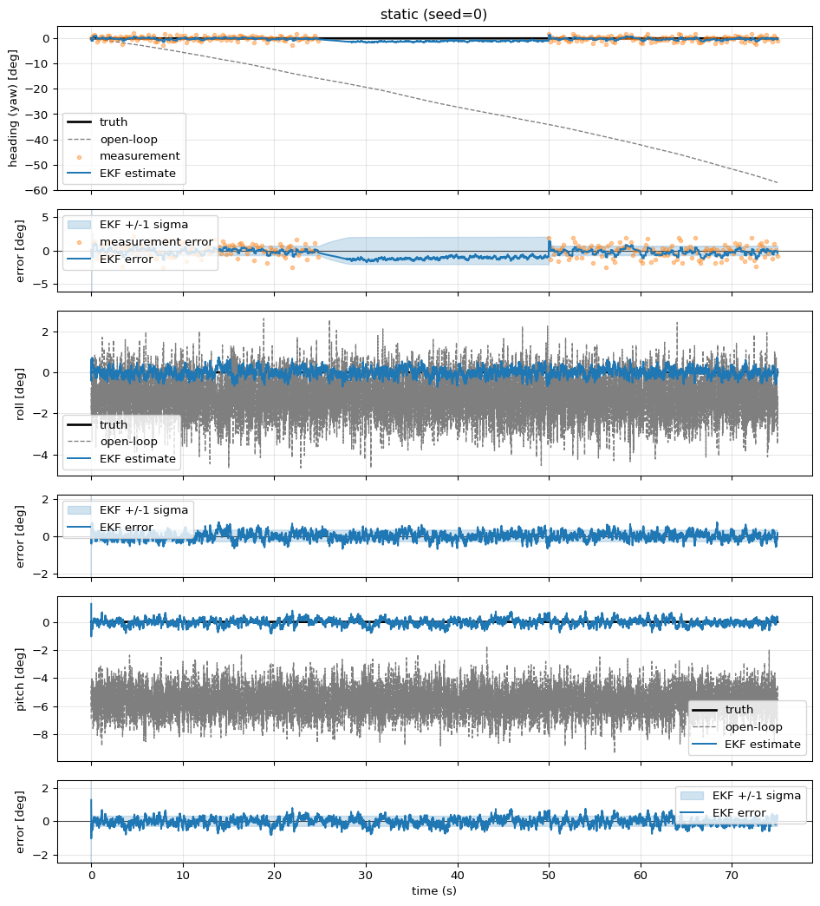
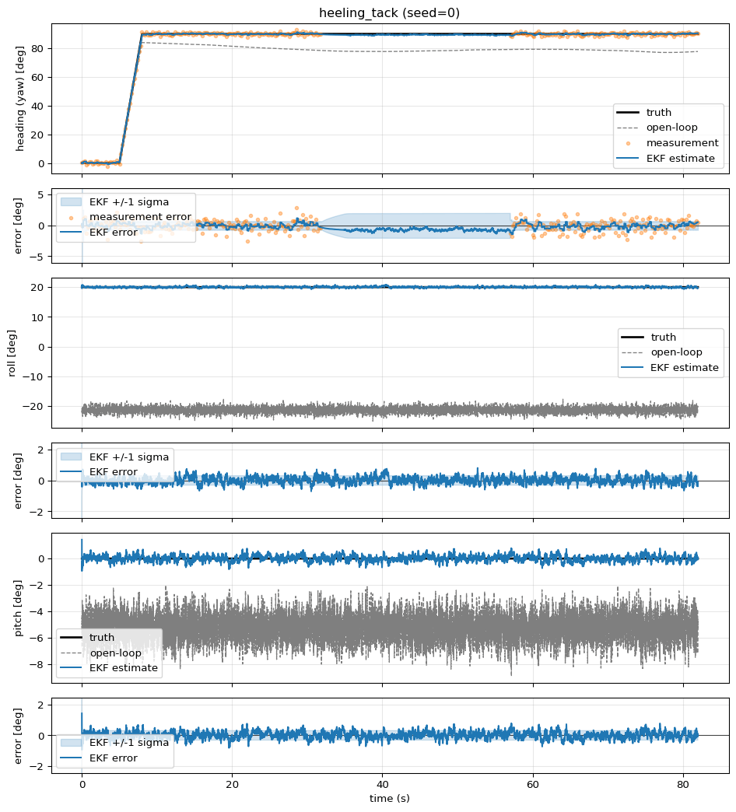
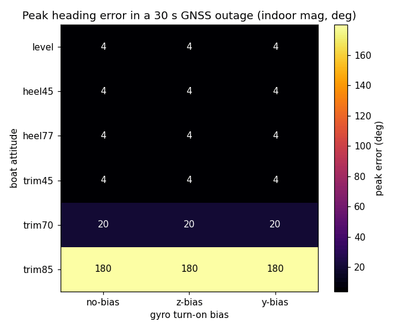
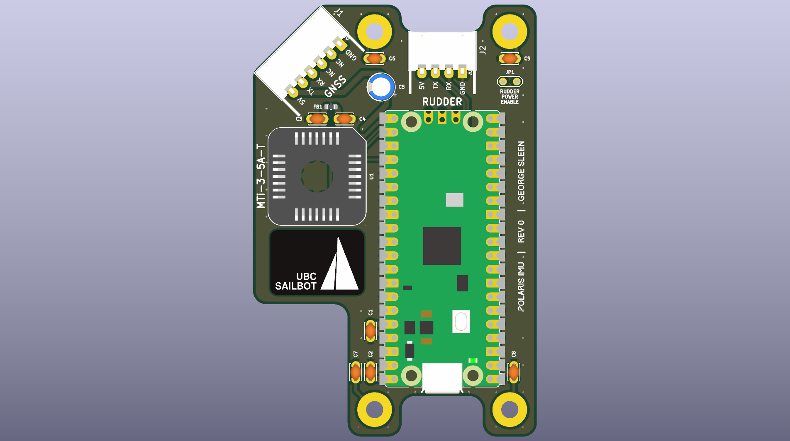
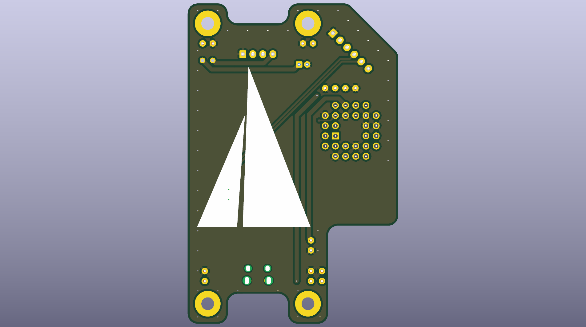

# PLRS-IMU

## Overview

PLRS-IMU is the heading sensor fusion system for [UBC Sailbot](/projects/ubc-sailbot/)'s
autonomous sailboat Polaris. The goal is heading accuracy of 2 degrees or less
by fusing an IMU and dual-antenna GNSS through an Extended Kalman Filter.

The project spans three layers: C++23 firmware on an RP2040 running FreeRTOS,
a custom PCB designed in KiCad, and a Python simulation that runs the same
compiled filter offline for tuning and validation. I am the sole author of 173
out of 175 commits.

## Hardware

- **MCU:** Raspberry Pi RP2040 (Pico), with RP2350 support for newer boards
- **IMU:** Originally an Xsens MTi-3-5A-T. After the original sensor died, I
  swapped it for a BNO085 and wrote a full SHTP/SH-2 protocol layer from
  scratch.
- **GNSS:** Septentrio mosaic-go H (dual antenna, heading capable)
- **PCB:** Custom board I designed in KiCad, with the RP2040/RP2354, debug
  probe, and overvoltage protection

## Firmware

The firmware runs FreeRTOS on the RP2040. I wrote it in C++23. All protocol
layers (Xbus, SHTP/SH-2, SBF/NMEA) are Arduino-free and host-testable under
plain `g++ -std=c++23`.

The 7-state Extended Kalman Filter estimates:

- Heading, roll, and pitch
- 3-axis gyro bias
- Magnetometer offset

The gyro bias state is the key to holding heading through GNSS outages. When
fixes drop out, the filter has already learned the bias and can dead-reckon
with corrected gyro integration. The magnetometer offset provides a secondary
anchor when GNSS is unavailable.

## Simulation

The same C++ EKF code that ships on the RP2040 is bound into Python via
nanobind. This lets me run the filter offline against synthetic sensor data for
visualization and tuning. Tuning values transfer faithfully because the same
compiled filter runs in both environments.

The sim includes:

- Timeseries plots of truth vs. estimate with residuals and 1-sigma bands
- A 3D boat visualization showing truth, EKF estimate, and raw IMU
- A drift sweep heatmap that maps peak heading error across every combination
  of boat attitude and turn-on gyro bias

_EKF holding heading through a GNSS outage:_

_Same scenario at 20 degree heel with a body-Y gyro bias:_

_Peak heading error across the full attitude envelope during a 30 s outage:_

## PCB

I designed the custom PCB for the IMU system in KiCad. It carries the
RP2040 (or RP2354), the IMU sensor, a debug probe header, and overvoltage
protection circuitry. The board connects to the Septentrio GNSS module and
communicates with the rudder controller over the COBS serial link.

_PCB front:_

_PCB back:_

## Scale

The codebase totals approximately 17,000 lines: 5,700 lines of C++ firmware,
7,200 lines of Python simulation, and 4,000 lines of C++ tests.

## Repositories

- Firmware and simulation: [github.com/UBCSailbot/PLRS-IMU](https://github.com/UBCSailbot/PLRS-IMU)
- PCB: [github.com/georgesleen/polaris-imu-pcb](https://github.com/georgesleen/polaris-imu-pcb)
