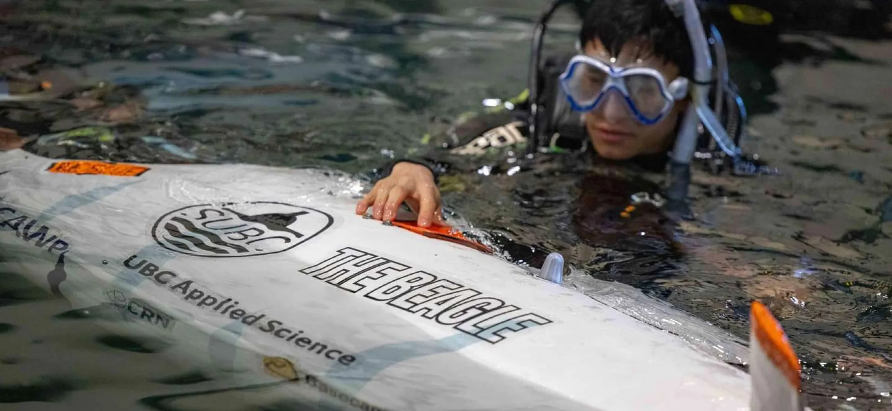
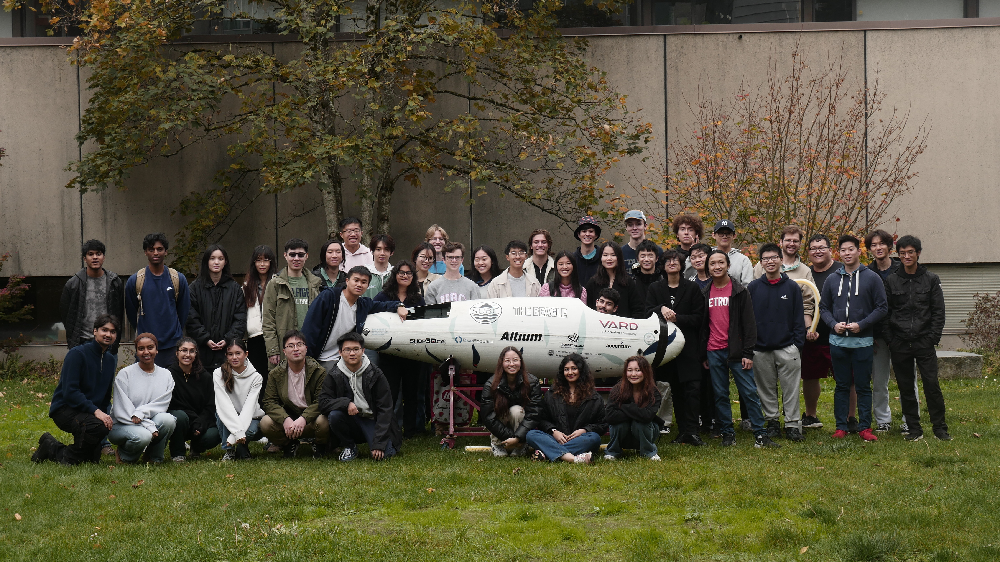
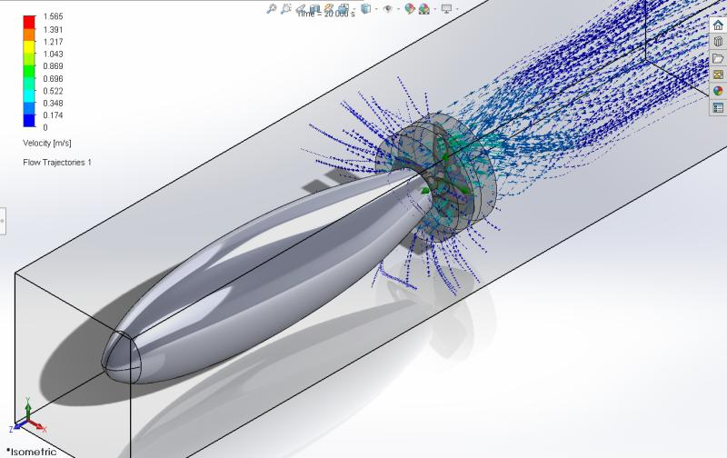

# SUBC

## Overview

SUBC (UBC Submarine Design Team) designs and builds a human-powered submarine to compete in international races. In my
first year, I joined the drivetrain and propulsion team. One of my main projects was helping design a toroidal
propeller. I focused on evaluating candidate geometries with CFD, selecting a promising design, and supporting
manufacturing using 3D printing and epoxy resin.

---

## My Contributions

- Performed CFD analysis to compare propeller candidates and select the best design.
- Supported manufacturing by preparing the 3D-printed parts and epoxy finishing process.
- Worked on drivetrain reliability, including replacing a chain drive with a gear drive to eliminate skipping.
- Built a test jig to measure propeller characteristics outside the submarine.

---

## Positions

- Drivetrain and propulsion member (2023–2024)
- Propulsion lead (2024–2025)
- Team captain (2024–2025)

---

## Technical Highlights

- **Analysis:** CFD-driven selection of the propeller geometry.
- **Manufacturing:** 3D-printed core with epoxy resin finishing.

---

## Media

- *SUBC team photo*  
  

- *CFD analysis*  
  

---

## Project Website

[subc.ca](https://subc.ca)
