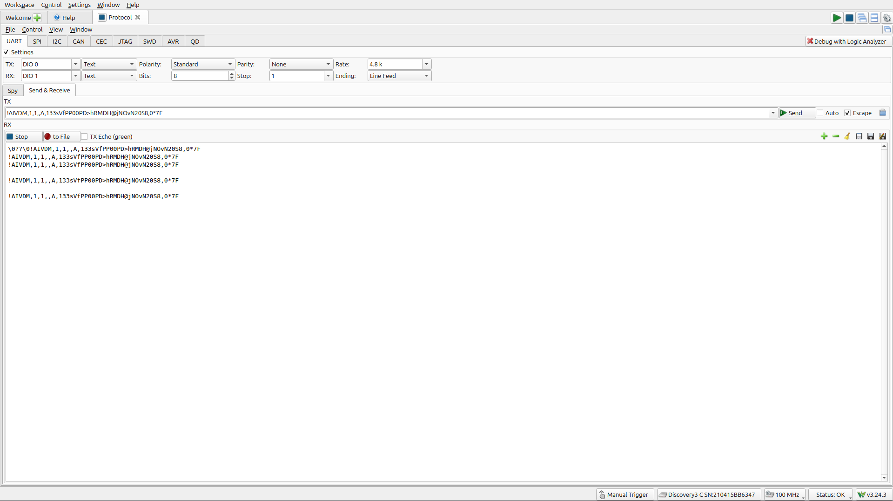
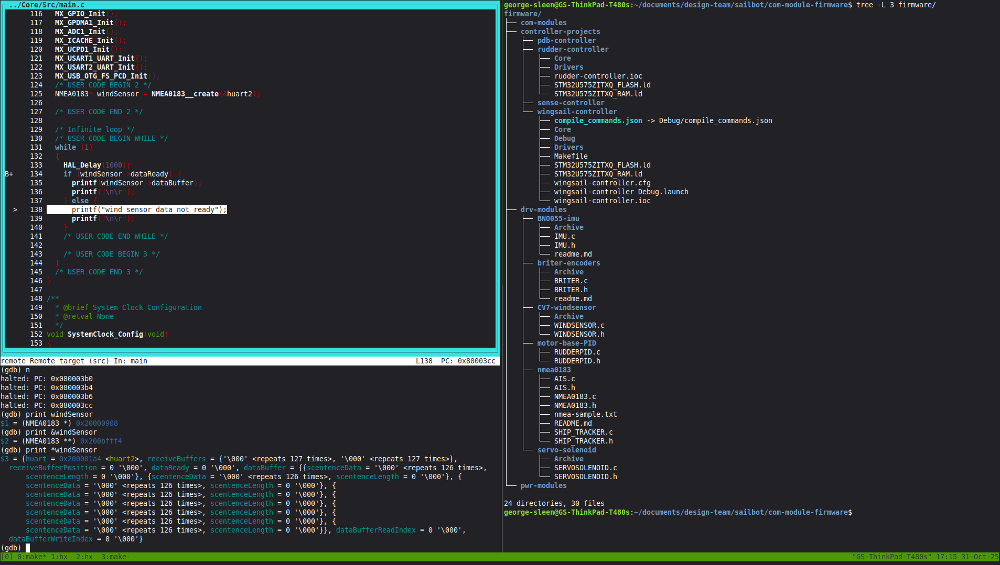

# UBC Sailbot

## Overview

UBC Sailbot builds an autonomous sailboat called Polaris. I joined the team in
September 2025 and work on the embedded systems that keep the boat running: the
shared communication firmware that ties the subsystems together, and the
[PLRS-IMU](/projects/plrs-imu/) heading sensor fusion system (covered on its
own page).

---

## Communication Module Firmware

The boat's subsystems (rudder controller, wingsail controller, sensor module,
power distribution) each run on STM32U575 Nucleo boards. The communication
module firmware is the shared codebase for all of them.

My contributions include:

- **NMEA0183 parsing** for the LCJ CV7 wind sensor. I wrote clean parsers with
  typed structs so the data self-documents. No more raw fixed-point integers
  with comments explaining how to decode them.
- **Rudder link protocol.** I designed a COBS-framed serial protocol that feeds
  the fused heading from the IMU to the rudder controller.
- **Rudder equivalence analysis.** When a teammate refactored the rudder control
  model, I did a forensic comparison and found two real bugs: a doubled integral
  increment and uninitialized state.
- **Integration and branch management.** I merged the wingsail, rudder, PDB,
  and sensor module branches into one coherent state, documented all branch
  tips, and wrote the git flow and testing workflow for the team.
- **CI pipeline.** I set up GitHub Actions for `.ioc` peripheral checking and
  host unit tests.

I started on this codebase in October 2025, learning the team's STM32CubeIDE
workflow and the Nucleo hardware. My early work sessions involved getting UART
printing to work, debugging I2C and NMEA protocol issues with an Analog
Discovery 3, and writing unit tests for the wind sensor parser.

_UART loopback test on the Analog Discovery 3 protocol analyzer:_

_Debugging the wind sensor driver with GDB on the STM32:_

---

## Repositories

- PLRS-IMU (separate page): [PLRS-IMU project](/projects/plrs-imu/)
- Communication firmware: [github.com/UBCSailbot/com-module-firmware](https://github.com/UBCSailbot/com-module-firmware)
