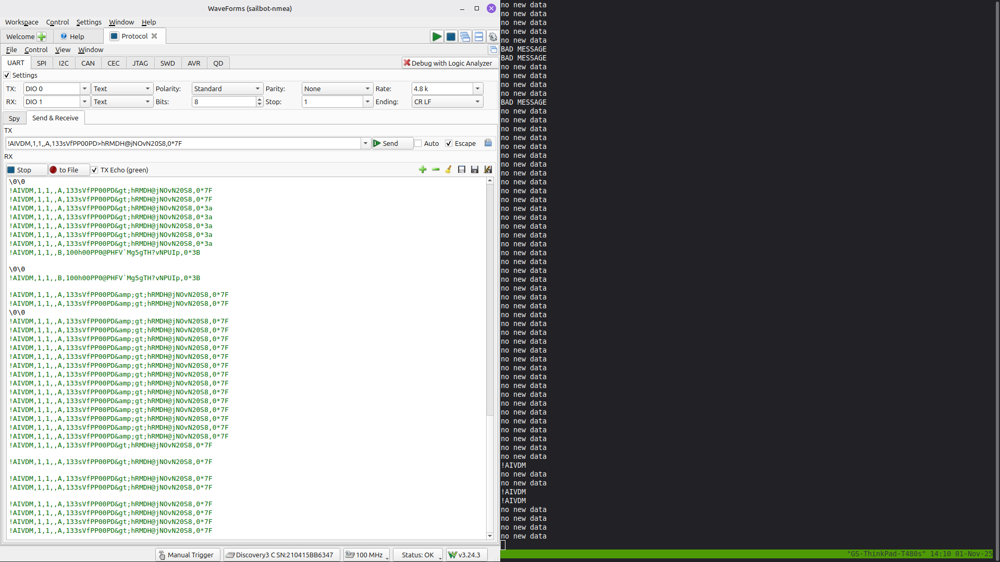

# UBC Sailbot

UBC Sailbot builds an autonomous sailboat called Polaris. I joined in September 2025, and I mostly work on the embedded side — the shared communication firmware every subsystem runs, and the [PLRS-IMU](/projects/plrs-imu/) heading sensor (which has its own page).

Every subsystem — rudder controller, wingsail controller, sensor module, power distribution — runs the same STM32U575 codebase. A change to a sensor parser or a protocol touches every board on the boat at once.

My first few weeks were spent getting boards to actually talk. UART loopback, I2C probing with an Analog Discovery 3, and a lot of GDB in the wind-sensor driver.

## Communication firmware

The LCJ CV7 wind sensor talks NMEA0183, and I worked on the typed parser for it — the messages come out as structs rather than raw fixed-point integers with a comment on top explaining how to decode them.

One CV7 bug I chased down there: the scheduler was publishing CAN message `0x040 SAIL_WIND` after both the MWV and XDR sentences. XDR only carries temperature, so the second publish shipped stale wind data every cycle. Commit `f841995` publishes it on MWV only.

I also designed the COBS-framed serial link between PLRS-IMU and the rudder controller, wrote the surrounding protocol docs, integrated four development branches into one working state, and set up the GitHub Actions checks that gate `.ioc` peripheral configuration and host unit tests.

## Rudder-controller refactor

After four months of parallel rudder tuning and refactoring landed on the same branch, nobody could confidently say whether the merged controller still behaved like the version that had been on the water. I built a differential harness that fed both the pre- and post-refactor builds the same 200 randomised trajectories, 10,000 samples each.

The shipped firmware defines `STRAIGHT_ONLY`, so `runPID` only reaches `straightLine()`. On that path the refactor matched the old behavior once two real bug fixes were included.

The first was an integral accumulation added twice in the same branch on the tuning line — the integral term ran 1.5× fast whenever the output wasn't clamped, worth up to 1.28° of rudder difference across the test sweep. The second was a controller state struct left uninitialized (`ControllerState cState;` never zeroed), so `integralError`, `previousError`, and `filteredError` were reading whatever was on the stack.

The state-machine paths outside `STRAIGHT_ONLY` were intentionally different and had their own open issues; my conclusion was scoped to the path the boat actually runs.

- Communication firmware: [github.com/UBCSailbot/com-module-firmware](https://github.com/UBCSailbot/com-module-firmware)
- PLRS-IMU: [PLRS-IMU project](/projects/plrs-imu/)
