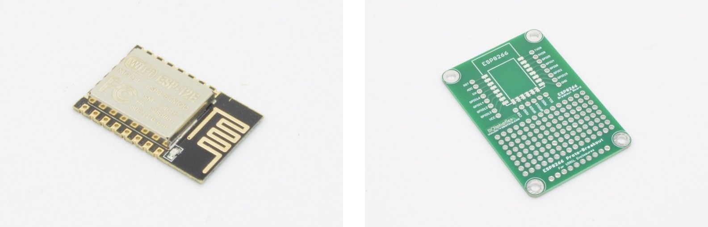
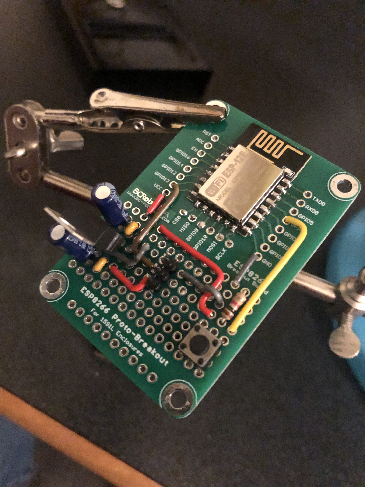
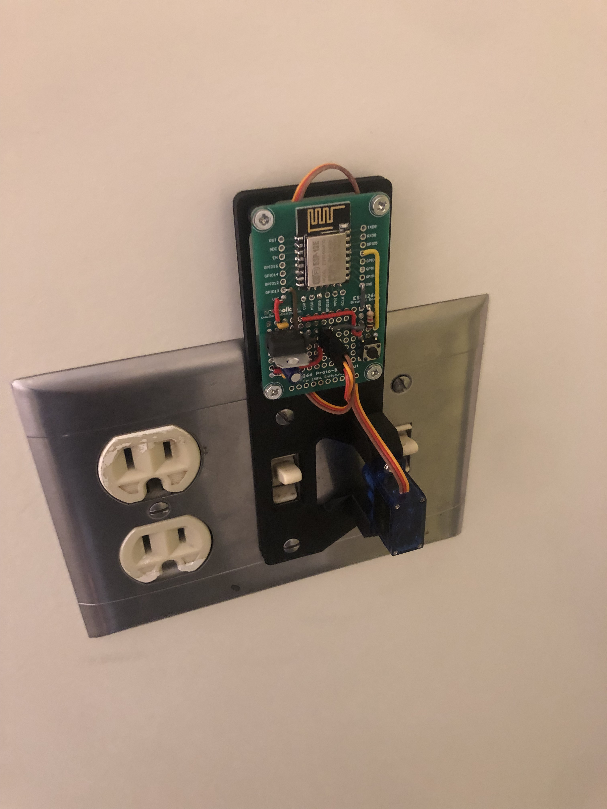

# Wi-Fi Controlled Lights

## Overview

This project explored adding IoT functionality to an everyday object: a dorm room light switch.  
Rather than modifying wiring in the wall, the design used a non-destructive mechanical actuator driven by a
Wi-Fi-connected microcontroller.

The goal was simple: be able to turn the light off remotely, while keeping the switch usable in the normal way.

---

## My Contributions

- Selected and programmed an ESP8266 for wireless connectivity.
- Designed and assembled supporting circuitry on a small proto-board, including:
    - 3.3 V linear regulator for the ESP8266
    - GPIO-connected push button for manual switching
    - Servo header powered from the USB rail
- Modeled and 3D printed a servo mount that attached to the light switch plate without altering existing wiring.
- Integrated with Adafruit IO for cloud connectivity and remote actuation.
- Debugged connectivity limitations on WPA2 Enterprise networks, eventually implementing a fallback mode as a local
  wireless access point.

---

## Technical Highlights

- **Non-destructive mechanism:** The servo mount attached to the switch plate screws, enabling easy installation and
  removal.
- **Circuit design:** Simple proto-board assembly provided regulation, I/O expansion, and servo control.
- **Connectivity:** Initially controlled via Adafruit IO cloud dashboard; later reconfigured to act as a standalone
  access point due to campus Wi-Fi restrictions.
- **Firmware:** Developed in Arduino IDE; managed GPIO states for both physical button input and servo actuation.

---

## Media

- *ESP8266 proto-board and supporting circuitry*  
  

- *Assembled circuit with servo control*  
  

- *Final dorm room assembly*  
  

---

## Reflection

Although the final version was limited by campus network constraints, the project successfully demonstrated how to
integrate embedded hardware, 3D-printed mechanics, and IoT software into a complete system.

It reinforced the value of designing around real-world constraints (non-destructive mounting, limited Wi-Fi
compatibility) and gave me experience with both cloud IoT platforms and low-level firmware on the ESP8266.
